<p align="center">
  
</p>

<h1 align="center">Career Workflow</h1>

<p align="center">
  <strong>AI-Assisted Job Discovery, Evaluation, and Application Orchestration Engine</strong>
</p>

<p align="center">
  
  
  
  
  
  
  
  
</p>

<p align="center">
  
  <br>
  <em>The Career Workflow React Operations Console.</em>
</p>

<p align="center">
  <sub>Originally derived from the NopeRi API-client foundation and substantially extended into a policy-driven application orchestration, lifecycle intelligence, and adaptive strategy system.</sub>
</p>

---

## Table of Contents

- [What is Career Workflow?](#what-is-career-workflow)
- [Key Features](#key-features)
- [Screenshots](#screenshots)
- [System Overview](#system-overview)
- [Architecture](#architecture)
- [Closed-Loop Strategy](#closed-loop-strategy)
- [Why This Is Different](#why-this-is-different-from-a-basic-auto-apply-bot)
- [Core Capabilities](#core-capabilities)
- [Operations Control Plane](#operations-control-plane)
- [Safety and Control Model](#safety-and-control-model)
- [Technology Stack](#technology-stack)
- [Repository Structure](#repository-structure)
- [Quick Start & Installation](#quick-start)
- [Configuration Surface](#configuration-surface)
- [Command Line Reference & Usage](#command-line-reference)
- [Scheduler](#scheduler)
- [Operational Data Model](#operational-data-model)
- [Runtime Artifacts](#runtime-artifacts)
- [Testing](#test-coverage-by-domain)
- [Performance & Cost Control](#progressive-cost-control)
- [Development Workflow](#design-principles)
- [FAQ & Troubleshooting](#faq--troubleshooting)
- [Roadmap](#roadmap)
- [Credits & License](#origin-and-attribution)

---

## What is Career Workflow?

**The Problem:** Standard "auto-apply" bots blindly blast identical resumes to hundreds of companies based on simple keyword matches, leading to poor candidate fit, immediate rejections, and low interview rates. They ignore the nuances of role transition, work-mode constraints, and the reality that different applications require distinct strategies.

**The Solution:** Career Workflow is a policy-driven, closed-loop job application orchestration system. It automates job acquisition, candidate-aware evaluation, ranking, policy-controlled application execution, and lifecycle tracking. It uses AI to determine fit instead of just keywords, handles multi-page application questionnaires dynamically, and adapts its application strategy based on actual outcomes.

**Target Users:** Software Engineers, AI Engineers, Data Scientists, and tech professionals looking to optimize their job search process with precision rather than spam.

**Why it exists & What makes it different:** It treats job application as a decision pipeline, not a simple loop over search results. It prioritizes *controlled, high-quality* applications over volume, leveraging AI for both parsing Job Descriptions and resolving complex application questions. It features a React-based Operations Console to give you total visibility and control over the pipeline.

---

## Key Features

- **AI Job Discovery:** Broad, resilient search matrix capturing roles from Naukri, Indeed, LinkedIn, and Google (via JobSpy).
- **Multi-stage Classification:** Cascading filters that drop bad fits early (deterministic rejections) before utilizing LLMs for deep scoring.
- **AI Ranking:** Candidate-grounded fit scoring assessing stack overlap, transition-role viability, and seniority constraints.
- **Application Routing:** Intelligent dispatch of jobs to the correct engine (Naukri Native, ATS handler, or External Fallback).
- **Provider Abstraction:** Unified interface supporting multiple job boards seamlessly.
- **Manual Review Queue:** Intercepts ambiguous roles or complex applications for human review.
- **ATS Detection:** Prevents dead-ends by detecting and routing specific Applicant Tracking Systems.
- **Live Pipeline:** Real-time execution with lock management, crash recovery, and dry-run safety modes.
- **Event-driven Architecture:** Decoupled execution model utilizing a robust internal Event Bus.
- **React Operations Console:** A unified command center to control pipelines, review jobs, and analyze funnels.
- **Analytics:** Granular funnel conversion tracking, response velocity, and subtrack performance reporting.
- **Search Intelligence:** Cache visualization and provider acquisition breakdowns.
- **Pipeline Explorer:** Deep dive into the decision history and state of specific runs.
- **Job Trace:** End-to-end debugging of a single job's lifecycle from discovery to application outcome.
- **SQLite Cache:** Persistent job ledger and search caching to avoid redundant operations and network bans.
- **Resume Profiles:** Configurable candidate profile injection for hybrid questionnaire resolution.
- **Multi-provider Ready:** Extensible backend designed to support additional boards.
- **Rich Observability:** Comprehensive logging, run artifacts, diagnostics, and metric aggregation.

---

## Screenshots

<p align="center">
  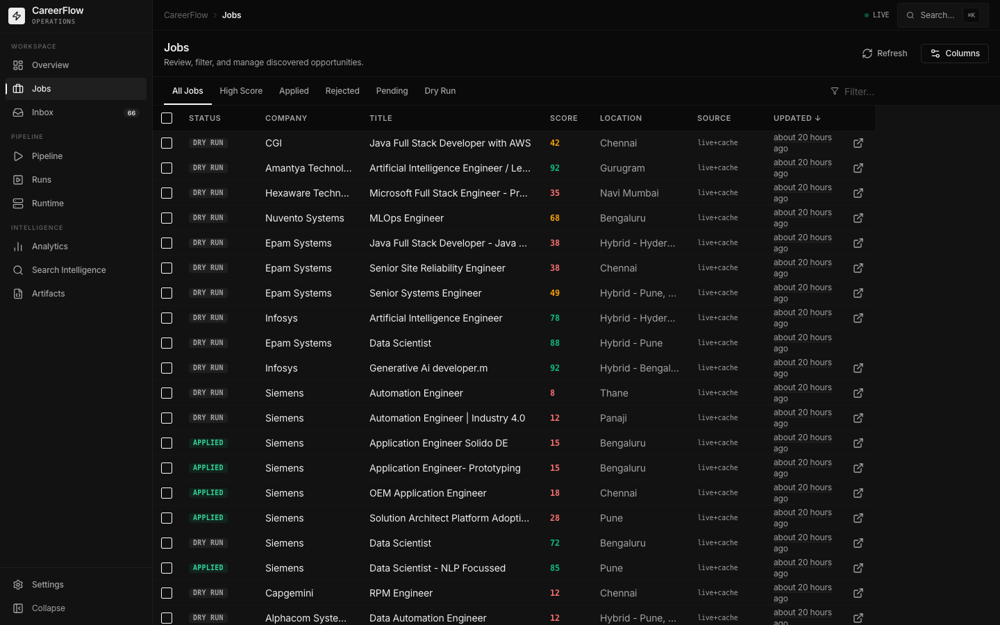
  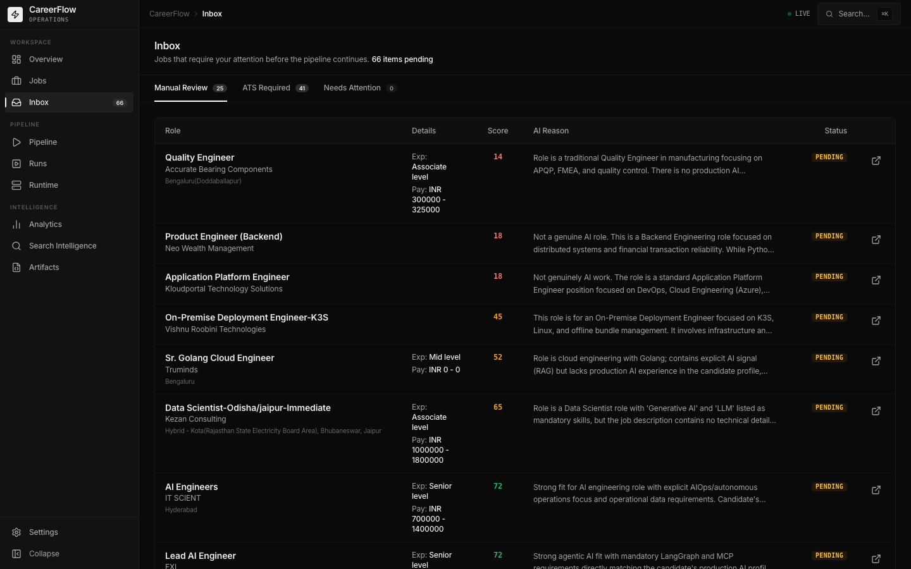
</p>
<p align="center">
  <em>Left: <strong>Jobs Workspace</strong> showing classified inventory. Right: <strong>Inbox</strong> for lifecycle tracking.</em>
</p>

<p align="center">
  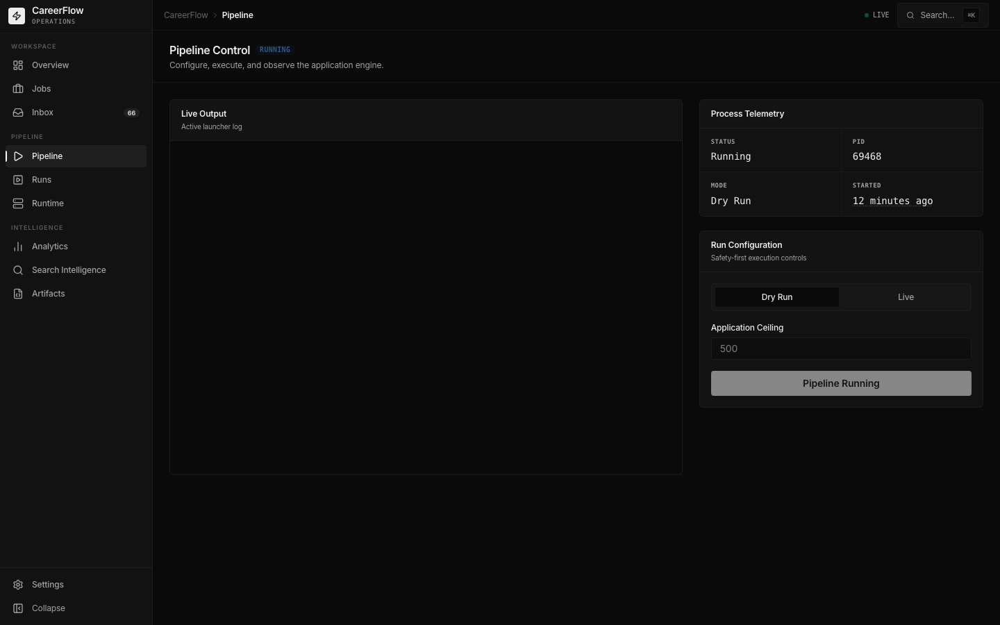
  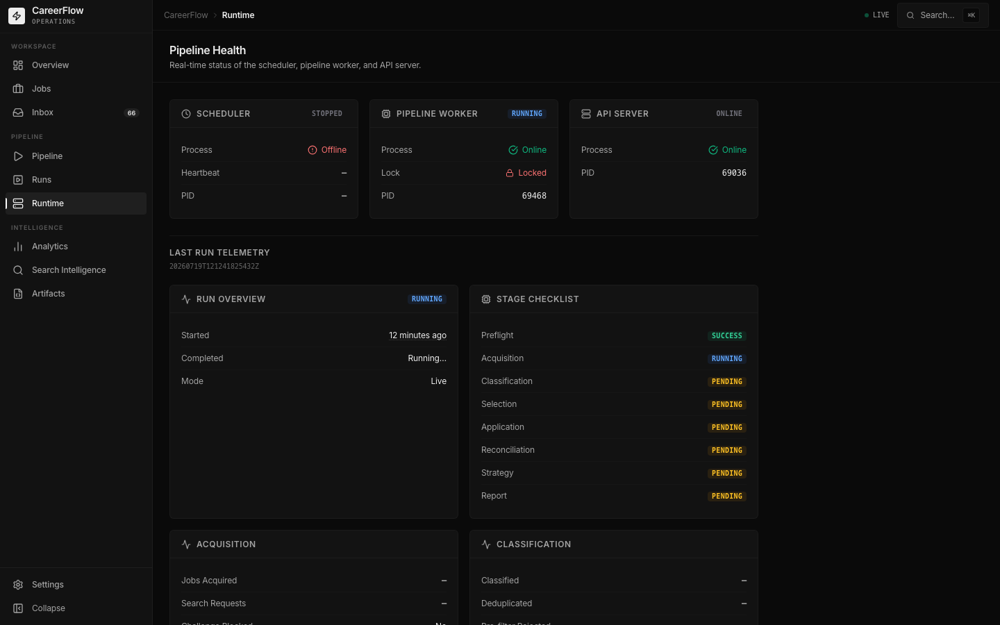
</p>
<p align="center">
  <em>Left: <strong>Pipeline Control</strong> for live/dry-run execution. Right: <strong>Pipeline Health</strong> and diagnostics.</em>
</p>

<p align="center">
  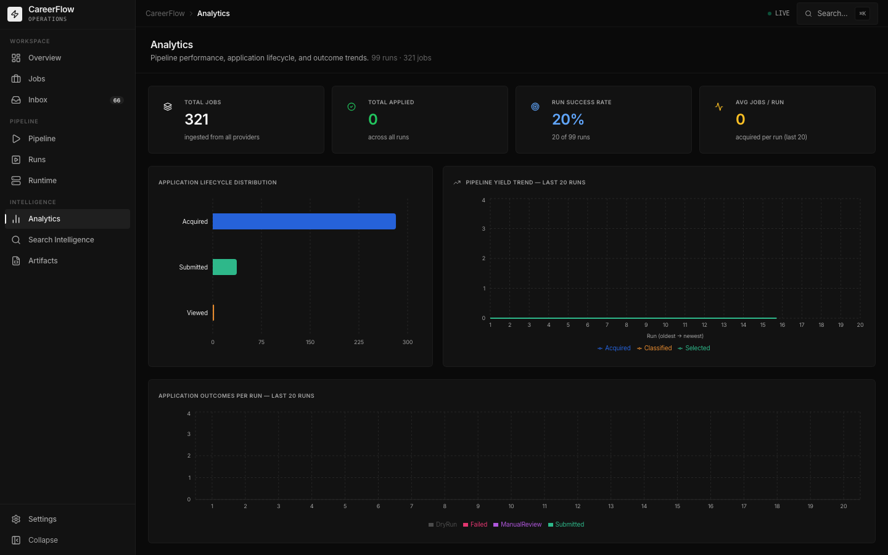
  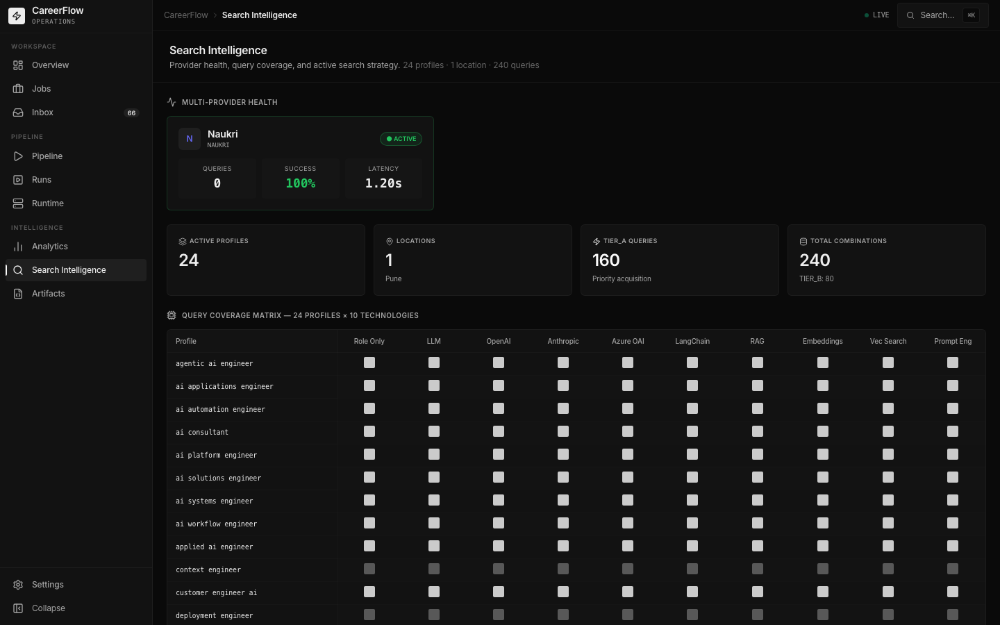
</p>
<p align="center">
  <em>Left: <strong>Analytics</strong> covering funnel conversion. Right: <strong>Search Intelligence</strong> showing acquisition sources.</em>
</p>

<p align="center">
  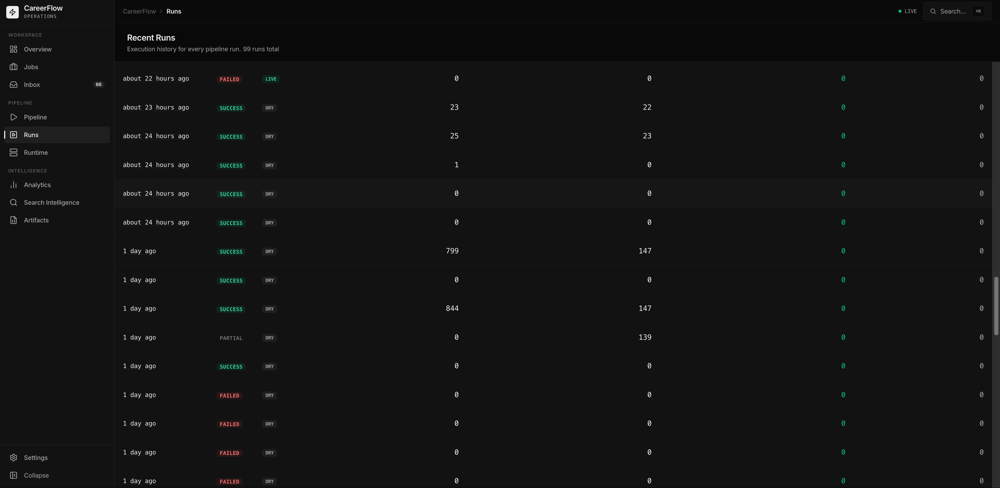
  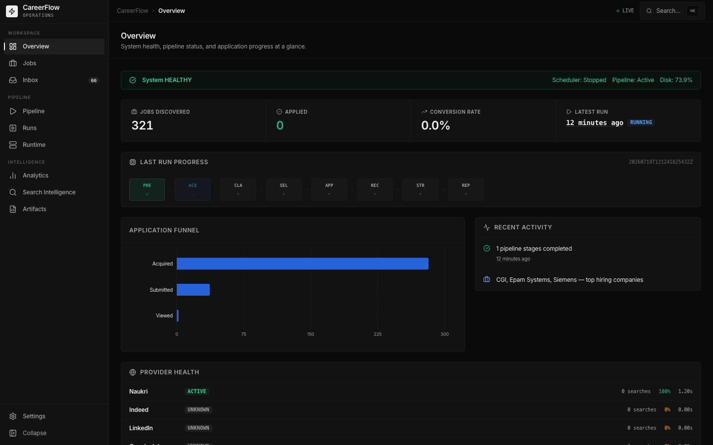
</p>
<p align="center">
  <em>Left: <strong>Run Inspector</strong> for artifact history. Right: Native <strong>Dark Mode</strong> support.</em>
</p>

---

## System Overview

Career Workflow is a closed-loop job application orchestration system that combines resilient job discovery, candidate-aware qualification, policy-controlled selection, application execution, questionnaire resolution, lifecycle tracking, funnel analytics, and evidence-gated strategy adaptation.

A React-based enterprise operations console sits above these systems, providing one interface for pipeline execution, application operations, run inspection, lifecycle analytics, and runtime diagnostics without replacing the underlying ledger, artifact, or policy layers.

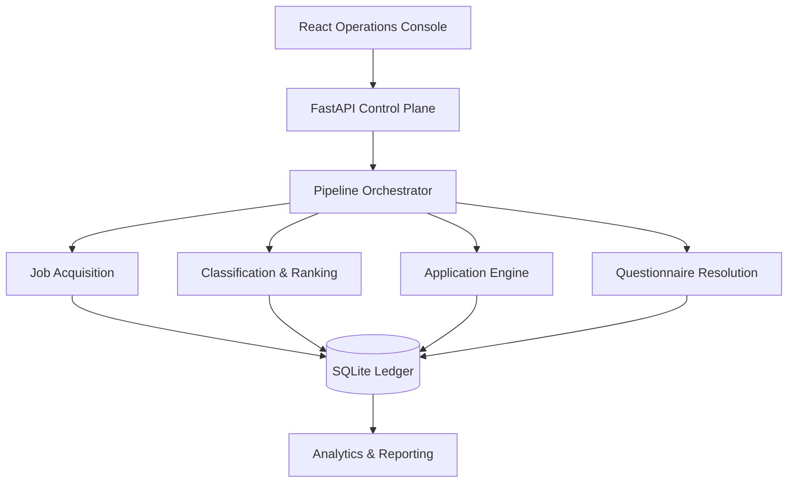

### Daily Operations

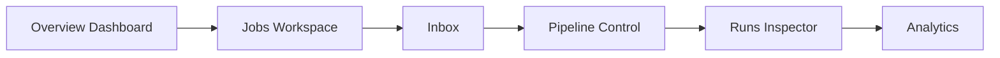

### System at a Glance

| Layer | What it does | State |
|---|---|:---:|
| Authentication | Session login, bearer token, cookies, OTP/MFA | ✅ |
| Search | Multi-query, multi-experience, paginated API acquisition | ✅ |
| Search termination | Empty-page, partial-page, repeated-page and challenge stop conditions | ✅ |
| Resilience | Search cache, challenge detection, cooldown, partial-result preservation and fallback | ✅ |
| Classification | AI relevance, title quality, red flags, candidate fit and transition-role compatibility | ✅ |
| Work-mode policy | Remote-anywhere; office/hybrid/unknown only when Pune-compatible | ✅ |
| Ranking | LLM-assisted fit scoring, deterministic guards and score caching | ✅ |
| Policy | Thresholds, duplicate prevention, run limits and dry-run controls | ✅ |
| Diversity | Company, role-family and vacancy-fingerprint concentration control | ✅ |
| Strategy | Evidence-gated adaptive thresholds and allocation | ✅ |
| Execution | Direct application and questionnaire application flows | ✅ |
| Resolution | Deterministic evidence + constraints + LLM fallback | ✅ |
| Failure handling | Response interpretation, retry policy, terminal states | ✅ |
| Ledger | SQLite state, event history, run summaries | ✅ |
| Monitoring | Server application-history reconciliation | ✅ |
| Lifecycle | Submitted → Viewed → Shortlisted → Interview → Outcome | ✅ |
| Analytics | Velocity, age, response time, funnel and segment performance | ✅ |
| Control plane | React Operations Console for execution, inspection and workflow management | ✅ |
| Pipeline operations | Dry-run/live launch controls, bounded execution and runtime inspection | ✅ |
| Run inspection | Immutable artifact history, stage state and diagnostic evidence | ✅ |
| System health | Runtime, storage, configuration and integration diagnostics | ✅ |
| Automation | Daemon scheduler with runtime recovery, locking, heartbeat and interactive workstation mode | ✅ |
| Runtime | Process state, lock management, recovery, watchdog and heartbeat | ✅ |
| Observability | Stage metrics, rejection analytics, runtime artifacts and execution reports | ✅ |

---

## Architecture

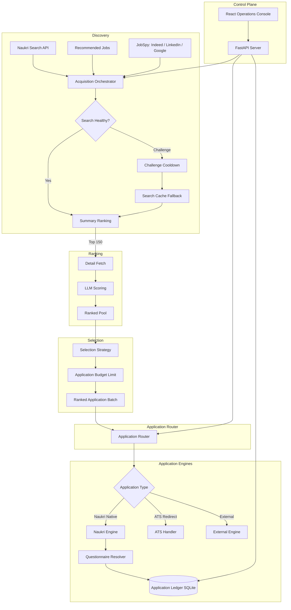

---

## Closed-Loop Strategy

The defining feature of the system is the feedback loop.

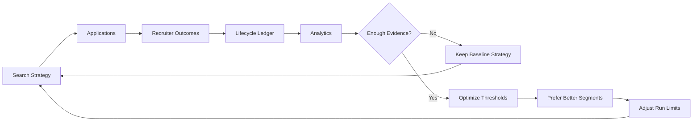

Adaptive behavior is deliberately evidence-gated. A rejection or two does not cause the system to thrash. Strategy changes only after sufficient outcome evidence exists.

Current adaptive controls include:
- minimum score threshold;
- maximum applications per run;
- preferred priority tiers;
- preferred role subtracks;
- allocation toward stronger-performing segments.

---

## Why This Is Different From a Basic Auto-Apply Bot

A basic bot:
```text
search → keyword match → apply → repeat
```

Career Workflow:
```text
resilient acquisition
        ↓
candidate-aware classification
        ↓
fit scoring + AI relevance gates
        ↓
application policy
        ↓
company + role-family diversity
        ↓
adaptive strategy
        ↓
safe execution
        ↓
questionnaire intelligence
        ↓
response interpretation
        ↓
failure classification + retry
        ↓
persistent application ledger
        ↓
server lifecycle reconciliation
        ↓
funnel analytics
        ↓
outcome-driven strategy feedback
```

This distinction matters. The system treats job application as a decision pipeline with state and feedback, not a loop over search results.

---

## Core Capabilities

### 1. Resilient Job Acquisition

Search acquisition is built to degrade safely.

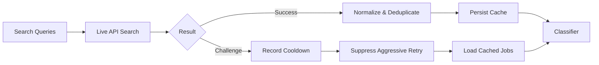

The acquisition layer is a bounded search matrix rather than a single search call.

Current acquisition capabilities include:
- a broad portfolio of AI, GenAI, LLM, RAG, agentic AI, ML, MLOps, NLP, computer-vision and AI-enabled full-stack search families;
- configurable experience buckets instead of a single hard-coded experience search;
- configurable pagination depth and per-page result sizing;
- deduplication across overlapping queries, experience buckets and pages;
- early termination on empty or partial terminal pages;
- repeated-page fingerprint detection to prevent useless pagination loops;
- persistent search-result caching with TTL;
- source attribution for live-only, cache-only and live-plus-cache jobs;
- challenge detection with partial results preserved;
- persistent challenge cooldown state with explicit bypass via `--force-live`.

### 2. Candidate-Aware Job Intelligence

The classifier `src/client/job_classifier.py` is not a generic keyword filter. It evaluates jobs against the target candidate profile and transition strategy.

The classification pipeline is deliberately staged so cheap deterministic rejection happens before expensive full-JD scoring:
```text
deduplicate → hard vetoes → title-quality filter → company vetoes → AI relevance gate → detail-fetch budget allocation → full JD red-flag analysis → structured work-mode + location policy → LLM-assisted fit scoring → post-score deterministic guards → ranked candidates
```

Location policy is asymmetric by design (e.g., Remote is eligible globally; Office/Hybrid is conservatively eligible only when locally compatible).

### 3. Policy and Diversity Engine

The system does not let a ranking score directly trigger unlimited applications.

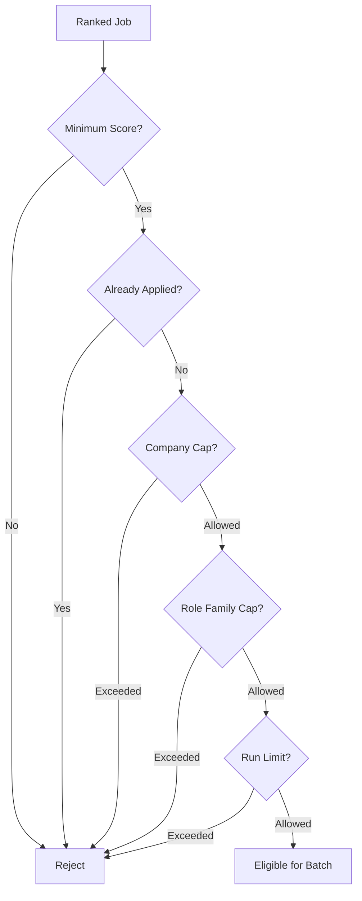

Controls include minimum score gates, duplicate application prevention, max applications per run, maximum applications per company per run, role-family concentration limits, and vacancy-fingerprint deduplication.

### 4. Hybrid Questionnaire Intelligence

Questionnaires are handled as a constrained resolution problem.

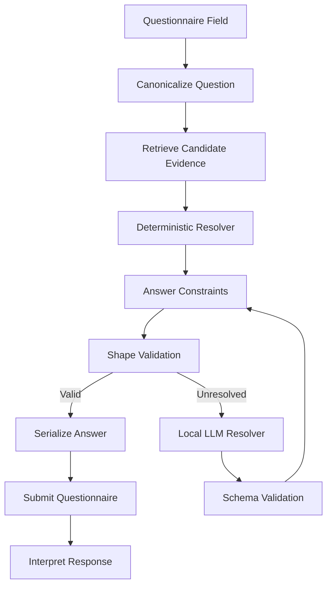

Resolution combines candidate profile data, deterministic matching, allowed-answer constraints, answer-shape validation, and local OpenAI-compatible LLM fallback, falling back to capturing unresolved cases for manual review.

### 5. Application Execution and Failure Handling

The executor interprets application responses semantically rather than treating every HTTP response as a binary success or failure. Recognized outcomes include `Applied`, `AlreadyApplied`, `QuestionnaireRequired`, `RecoverableFailure`, `TerminalFailure`, and `ManualReview`.

### 6. Persistent Application Ledger

The SQLite ledger (`data/application_ledger.db`) is the durable state layer of the system and the single source of truth for all application state, tracking scores, timestamps, acquisition sources, server statuses, and run summaries.

### 7. Server-Side Lifecycle Reconciliation

Run `python monitor_applications.py` to reconcile outcomes. The monitor authenticates, fetches complete application history, normalizes server statuses (SUBMITTED → VIEWED → SHORTLISTED → INTERVIEW), reconciles existing ledger records, and prints lifecycle funnels.

### 8. Application Intelligence

Run `python application_report.py` to generate metrics covering response rates, interview rates, application velocity, age distributions, and performance by priority and subtrack.

---

## Operations Control Plane

Career Workflow includes a React-based operations console for running and inspecting the application system without collapsing operational state into a collection of terminal commands.

### Operational surfaces

| Surface | Purpose |
|---|---|
| **Command Center** | Single-screen operational overview of process truth, artifact state, throughput, execution progression and recent runs. |
| **Pipeline** | Configure, launch and inspect dry-run or live pipeline executions. |
| **Jobs** | Inspect acquired and classified job inventory. |
| **Applications** | Browse application portfolio and lifecycle state. |
| **Manual / Review Queue** | Manage manually sourced opportunities and inspect unresolved automated shortlists. |
| **Analytics** | Inspect lifecycle conversion, response velocity, priority performance and subtrack performance. |
| **Run Inspector** | Examine immutable run artifacts and execution evidence. |
| **System Health** | Run preflight diagnostics across runtime, storage and integration dependencies. |
| **Settings** | Inspect operational configuration and runtime policy. |

### State semantics

The control plane distinguishes three different kinds of truth:
1. **PROCESS STATE**: what the launcher-owned process is doing now
2. **ARTIFACT STATE**: what the latest immutable run artifact records
3. **PORTFOLIO STATE**: what the persistent application ledger records over time

---

## Safety and Control Model

Automation is constrained at multiple levels:

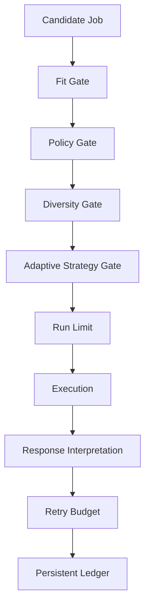

---

## Technology Stack

### Backend

| Component | Technology | Purpose |
|---|---|---|
| Core Language | Python 3.10+ | Orchestration and execution logic |
| API Layer | FastAPI | Serves data to the Operations Console |
| Server | Uvicorn | ASGI web server |
| Scraping / Automation | Playwright / JobSpy | Provider integration and headless browsing |
| State Management | SQLite | Persistent ledger for jobs, analytics, and lifecycle |

### Frontend

| Component | Technology | Purpose |
|---|---|---|
| Core Framework | React 19 (TypeScript) | UI foundation |
| Build Tool | Vite | Fast module bundling and HMR |
| Styling | Tailwind CSS | Utility-first CSS |
| UI Components | Radix UI / shadcn | Accessible component primitives |
| State / Fetching | Zustand / React Query | Global state and API data synchronization |
| Data Visualization | Recharts | Analytics and funnel charts |
| Routing | React Router DOM | Client-side navigation |

---

## Repository Structure

```text
.
├── CHANGELOG.md
├── README.md
├── api/                            # FastAPI backend for the Operations Console
│   ├── main.py
│   ├── routes.py
│   └── schemas.py
├── application_report.py
├── apply_agent.py
├── assets/                         # Documentation screenshots and static assets
├── config/                         # Search strategies, constants, and profiles
│   ├── candidate_evidence.py
│   ├── candidate_profile.py
│   ├── search_strategy.yaml
│   └── ...
├── control_center/                 # Framework-independent operational services
│   ├── analytics_helpers.py
│   ├── runner.py
│   ├── run_inspector.py
│   └── ...
├── data/                           # SQLite database (ledger, queues, caches)
│   ├── application_ledger.db
│   ├── job_search_cache.json
│   └── score_cache.json
├── docs/                           # Extended technical documentation
├── frontend/                       # Modern React + Vite operations console
│   ├── package.json
│   ├── src/
│   └── vite.config.ts
├── monitor_applications.py         # External lifecycle reconciliation script
├── pyproject.toml
├── requirements.txt
├── run_pipeline.py                 # Main execution entrypoint
├── run_scheduler.py                # Daemon mode execution
├── src/
│   ├── acquisition/                # JobSpy & provider integrations
│   ├── application/                # Routing, execution, queues, and policy
│   ├── client/                     # Session management and job classifiers
│   ├── config/                     # Core system config
│   ├── exceptions/                 # Custom error models
│   ├── llm/                        # LLM clients and schemas
│   ├── models/                     # Shared data models
│   ├── orchestration/              # Pipeline events, runtime, and stages
│   ├── resolution/                 # Hybrid questionnaire resolvers
│   ├── search/                     # Job search caching and challenges
│   ├── state/                      # SQLite handlers and schemas
│   └── utils/                      # Telemetry and helper functions
├── tests/                          # Pytest suite
└── tools/                          # CLI utilities (diagnostics, backfills)
```

---

## Quick Start

### 1. Clone and create an environment

```bash
git clone https://github.com/your-username/career-workflow.git
cd career-workflow

python -m venv .venv
source .venv/bin/activate

pip install -r requirements.txt
```

### 2. Configure environment variables

```bash
cp .env.example .env
```

Example:
```env
NAUKRI_USERNAME=your_email@example.com
NAUKRI_PASSWORD=your_password

OMLX_BASE_URL=http://localhost:8000/v1
OMLX_MODEL=your-model-name
OMLX_API_KEY=

MAX_APPLICATIONS_PER_COMPANY_PER_RUN=2
MAX_ROLE_FAMILY_PER_COMPANY=1
```

### 3. Launch the Operations Control Plane

Start the backend API server:
```bash
uvicorn api.main:app --reload
```

In a new terminal window, start the React frontend:
```bash
cd frontend
npm install
npm run dev
```

---

## Configuration Surface

Configuration is managed via Python/YAML files in the `config/` directory and environment variables in `.env`.

Representative controls:
```env
APPLICATION_DRY_RUN=true
MAX_APPLICATIONS_PER_RUN=10

JOB_SEARCH_CACHE_PATH=data/job_search_cache.json
JOB_SEARCH_CACHE_TTL_DAYS=3

SEARCH_CHALLENGE_STATE_PATH=data/search_challenge_state.json
SEARCH_CHALLENGE_COOLDOWN_MINUTES=60

ADAPTIVE_STRATEGY_ENABLED=true
AUTO_APPLY_MIN_SCORE=70

DETAIL_FETCH_BUDGET=100
MAX_APPLICATIONS_PER_COMPANY_PER_RUN=2
```

These values are operational policy, not universal recommendations. The repository keeps the mechanism configurable so search breadth, detail-fetch cost, application throughput and diversity constraints can evolve independently.

---

## Command Line Reference

### Common Commands

```bash
# Backend
uvicorn api.main:app --reload

# Frontend
npm run dev

# Dry Run
python run_pipeline.py

# Live
python run_pipeline.py \
  --live \
  --confirm-live APPLY_LIVE

# Scheduler
python run_scheduler.py --interactive

# Tests
pytest

# Monitor
python monitor_applications.py

# Analytics
python application_report.py
```


### Main Commands

`run_pipeline.py` is the staged orchestration entry point.

```bash
run_pipeline.py

--live
    Enables real application submission.

--confirm-live APPLY_LIVE
    Required confirmation token for live execution.

--provider
    all | naukri | jobspy

--acquisition-mode
    full | incremental

--force-live
    Ignores recorded acquisition cooldowns and performs a live search.

--max-applications
    Optional execution ceiling. Omit for unlimited policy-controlled execution.

--canary
    Automatically limits a live execution to one application.
```

### Example Commands

**Full Live Run / Production Execution**
```bash
python run_pipeline.py   --live   --confirm-live APPLY_LIVE   --acquisition-mode full   --provider all   --force-live
```

**Broad validation dry run**
```bash
python run_pipeline.py --max-applications 50
```

**Small live canary**
```bash
python run_pipeline.py --live --confirm-live APPLY_LIVE --max-applications 3
```

**Controlled live run**
```bash
python run_pipeline.py --live --confirm-live APPLY_LIVE --max-applications 15
```

---

## Scheduler

Career Workflow supports two execution models via `run_scheduler.py`.

### Daemon Mode (Production)
Runs continuously using the configured schedule.
```bash
python run_scheduler.py
```
- waits until the configured full-run window
- executes incremental searches using the configured interval

### Interactive Mode (Workstation)
Optimized for running on a local development machine.
```bash
python run_scheduler.py --interactive
```
- immediately performs a full pipeline run
- stays alive after completion, performs incremental searches every 30 minutes

### Interactive Session
Automatically terminates after a work session.
```bash
python run_scheduler.py --interactive --session-hours 2
```

---

## Operational Data Model

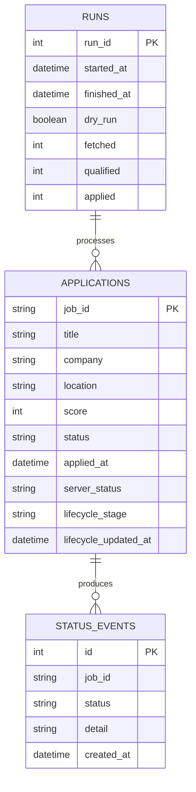

---

## Runtime Artifacts

Typical local runtime state:

| Artifact | Purpose |
|---|---|
| `application_ledger.db` | Authoritative application and lifecycle state |
| `job_search_cache.json` | Search resilience fallback |
| `score_cache.json` | Reuse previous scoring results |
| `questionnaire_telemetry.csv` | Resolution diagnostics |
| `responses/` | Raw and unresolved API response captures |

### Pipeline Artifacts (`artifacts/runs/<run_id>/`)

| Artifact | Purpose |
|---|---|
| `manifest.json` | Run metadata, timestamp, and status |
| `timeline.json` | Execution stage durations |
| `environment.json` | Execution context and policies |
| `diagnostics.json` | System state and health |
| `classification.json` | Core classification stage summary |
| `selection.json` | Selection stage summary |
| `application.json` | Application stage summary |
| `selected_jobs.json` | Jobs selected for application with decision history |
| `rejected_jobs.json` | All rejected jobs with rejection stage, code, and reason |
| `applied_jobs.json` | Successfully applied jobs for this run |
| `already_applied.json` | Jobs skipped due to duplicate application state |
| `external_apply.json` | Jobs requiring external application |
| `manual_review.json` | Jobs flagged for human review |

---

## Test Coverage by Domain

The repository contains a domain-organized test suite.

```text
tests/
├── application/    policy, strategy, lifecycle, ledger, analytics, execution
├── client/         login, session, history, direct application flows
├── llm/            local client, schemas, LLM resolver
├── resolution/     constraints, hybrid resolution, telemetry, serialization
└── search/         acquisition, cache, challenge handling, cooldown
```

Complete validation:
```bash
python -m pytest
```

Current validation status:
- 480+ backend tests passing
- Scheduler runtime tests passing
- Interactive scheduler tests passing
- Application tests passing

---

## Factory Reset (Fresh Start)

Use this procedure when you want to discard all runtime state and begin with a completely fresh portfolio.

> **Warning**
> This permanently removes local application history, cached search results, runtime state, run artifacts, logs, and generated data. Only use it when intentionally starting from scratch.

```bash
# Stop the UI and scheduler first.

rm -rf artifacts/runs/*
rm -rf logs/*
rm -f data/application_ledger.db
rm -f data/job_search_cache.json
rm -f data/score_cache.json
rm -f data/manual_jobs.db
rm -f data/manual_action_queue.json
rm -f data/search_challenge_state.json
rm -f data/runtime_state.json
rm -f data/scheduler_state.json
rm -f data/pipeline_state.json
rm -f data/heartbeat.json
rm -rf data/ui_runtime/*
rm -rf data/responses/*

mkdir -p artifacts/runs logs data/responses data/ui_runtime
echo "Factory reset complete."
```

---

## Provider Selection

The pipeline supports multi-provider execution, allowing you to run Naukri and JobSpy independently or together.

```bash
# Run both providers (default if enabled in config)
python run_pipeline.py --acquisition-mode full --provider all

# Run only Naukri
python run_pipeline.py --provider naukri

# Run only JobSpy
python run_pipeline.py --provider jobspy
```

### Provider Health & Degradation Safeguards
To prevent unstable job boards from exhausting network resources, the system tracks provider health at runtime. If a site returns 0 results or exceptions for 3 consecutive queries, it is marked as `degraded` and remaining queries for that site are skipped.

---

## Progressive Cost Control

The pipeline orders work so expensive operations are concentrated on plausible candidates.

```text
CHEAP / BROAD
    search acquisition
    normalization
    deduplication
    title and hard vetoes
    AI relevance gate
        ↓
MODERATE / NARROWER
    detail-fetch budgeting
    full JD retrieval
    red-flag analysis
    work-mode and location policy
        ↓
EXPENSIVE / SMALL SET
    fit scoring
    application execution
    questionnaire resolution
    local LLM fallback
```

---

## Design Principles

- **Candidate-grounded automation:** Application decisions based on explicit candidate profile data.
- **Controlled throughput:** More applications are not automatically better. Policy, diversity, and strategy layers control volume.
- **Conservative failure semantics:** Unknown responses are not assumed to be successes. They are classified and captured.
- **Idempotent reconciliation:** Running the monitor repeatedly should not create false changes.
- **Evidence before adaptation:** The strategy engine does not overreact to tiny samples.
- **Modular boundaries:** Acquisition, classification, policy, execution, and analytics remain independently testable.
- **Local-first intelligence:** Questionnaire LLM fallback can run against a local OpenAI-compatible endpoint.

---

## FAQ & Troubleshooting

**Problem: Pipeline gets stuck in a loop during search.**
**Solution:** Ensure `--force-live` is not constantly used if you are being rate-limited. Let the Challenge Cooldown handle backoff naturally.

**Problem: Applications are always failing with a validation error.**
**Solution:** Run `python tools/diagnostics/session_diagnostic.py` to ensure your session cookies or bearer tokens haven't expired.

**Problem: Database lock errors.**
**Solution:** The system uses a lock file. If the process crashed, manually delete `data/pipeline.lock`.

---

## Evolution

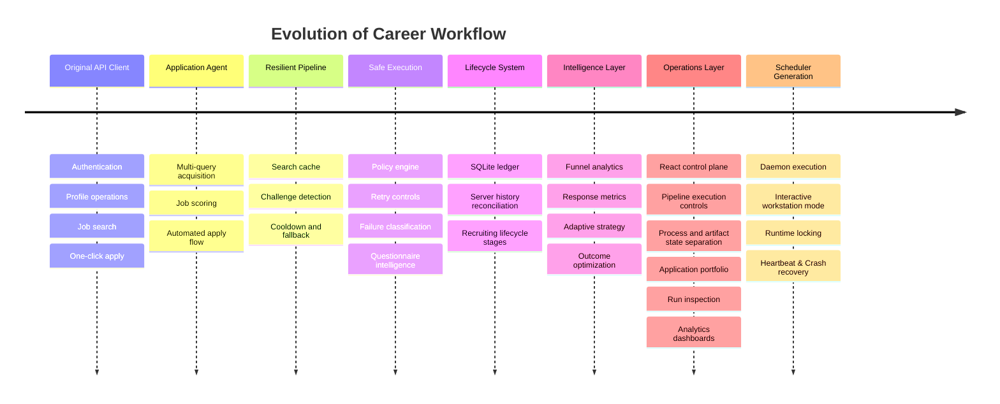

---

## Current Boundaries

- no hosted multi-user service; local operations control plane only
- no distributed worker architecture
- no guarantee of compatibility with future upstream API changes
- no claim that LLM-generated questionnaire answers are authoritative without candidate evidence

---

## Roadmap

### Completed
- [x] API authentication, session management, job search and application execution
- [x] resilient multi-query acquisition with caching, challenge detection and cooldown handling
- [x] candidate-aware classification, scoring, location policy, selection and diversity controls
- [x] hybrid deterministic and local-LLM questionnaire resolution
- [x] persistent application ledger, lifecycle tracking and server-history reconciliation
- [x] funnel analytics, response metrics and evidence-gated adaptive strategy
- [x] React operations console for pipeline execution, portfolio inspection and actionable workflow triage
- [x] daemon scheduler with runtime locking and recovery

### Next Operational Phase
- [ ] multi-platform job-source and application adapters beyond Naukri;
- [ ] stronger browser automation for application flows that cannot be completed through direct APIs;
- [ ] production deployment and remote operations for continuously running the workflow;
- [ ] outcome-driven strategy optimization using application, recruiter-response and interview-conversion data.

---

## Origin and Attribution

Career Workflow originated as a fork of the NopeRi project by Traverser25.
The upstream project provided the initial API-client foundation.
This repository has since been substantially extended with independently developed systems for resilient acquisition, AI-scoring, policy controls, persistent ledger, lifecycle analytics, React UI control plane, and scheduler generation. Repository history is preserved to maintain implementation provenance and attribution.

---

## Disclaimer & License

This project is intended for personal automation of the repository owner's own job-search workflow. It is not affiliated with Naukri or Info Edge. Users are responsible for reviewing applicable service terms and operating automation conservatively. Never commit credentials, session tokens, cookies, candidate evidence, raw application responses, or private application history to public source control.

**License:** Licensing of original contributions and upstream-derived portions should be considered separately unless explicit upstream permission is obtained.

---

<p align="center">
  <strong>Discover broadly. Decide carefully. Execute safely. Adapt from evidence.</strong>
</p>
