<p align="center">
  
</p>

<h1 align="center">Career Workflow</h1>

<p align="center">
  <strong>An adaptive, resilient, end-to-end job application intelligence system.</strong>
</p>

<p align="center">
  Search jobs. Rank fit. Enforce policy. Apply safely. Resolve questionnaires.<br/>
  Track recruiting outcomes. Learn from response data. Improve the next run.
</p>

<p align="center">
  
  
  
  
  
  
  
</p>

<p align="center">
  <sub>Built on top of the Noperi / NopeRi API client foundation and expanded into a complete decision, execution, tracking, analytics, and feedback system.</sub>
</p>

---

## Overview

Career Workflow is no longer a script that searches jobs and clicks Apply.

It is a closed-loop application system:

```text
DISCOVER → ACQUIRE → QUALIFY → SCORE → RANK → SELECT → APPLY
                                                       │
                                                       ▼
                                              RESOLVE QUESTIONS
                                                       │
                                                       ▼
                                                  TRACK STATE
                                                       │
                                                       ▼
                                              RECONCILE OUTCOMES
                                                       │
                                                       ▼
                                                ANALYZE FUNNEL
                                                       │
                                                       ▼
                                               ADAPT STRATEGY
                                                       │
                                                       └──────► NEXT RUN
```

The system combines API-level automation, candidate-aware job classification, resilient search acquisition, application policy, diversity controls, hybrid questionnaire resolution, retry and failure handling, persistent lifecycle tracking, funnel analytics, and evidence-gated adaptive strategy.

The objective is not maximum application volume.

The objective is a controlled system that sends better applications, avoids repeated mistakes, survives partial failures, observes recruiting outcomes, and changes strategy only when enough evidence exists.

---

## System at a Glance

| Layer | What it does | State |
|---|---|:---:|
| Authentication | Session login, bearer token, cookies, OTP/MFA | ✅ |
| Search | API search and recommended-job acquisition | ✅ |
| Resilience | Search cache, challenge detection, cooldown, fallback | ✅ |
| Classification | AI relevance, candidate fit, transition-role compatibility | ✅ |
| Ranking | Score-based ordering and application prioritization | ✅ |
| Policy | Thresholds, duplicate prevention, run limits | ✅ |
| Diversity | Company and role-family concentration control | ✅ |
| Strategy | Evidence-gated adaptive thresholds and allocation | ✅ |
| Execution | Direct application and questionnaire application flows | ✅ |
| Resolution | Deterministic evidence + constraints + LLM fallback | ✅ |
| Failure handling | Response interpretation, retry policy, terminal states | ✅ |
| Ledger | SQLite state, event history, run summaries | ✅ |
| Monitoring | Server application-history reconciliation | ✅ |
| Lifecycle | Submitted → Viewed → Shortlisted → Interview → Outcome | ✅ |
| Analytics | Velocity, age, response time, funnel and segment performance | ✅ |
| Automation | Unattended scheduled operation and notifications | 🚧 |

---

## Architecture

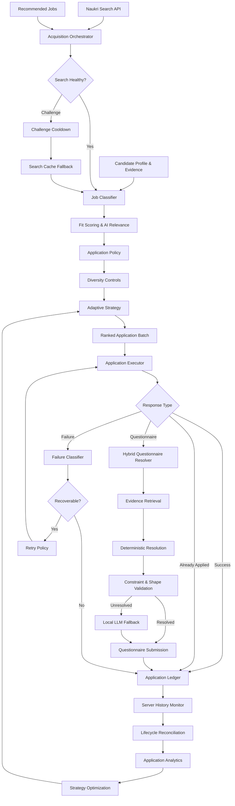

---

## Closed-Loop Strategy

The defining feature of the system is the feedback loop.

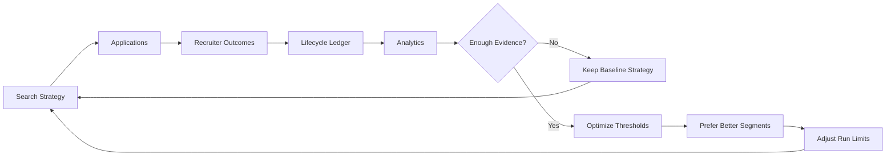

Adaptive behavior is deliberately evidence-gated. A rejection or two does not cause the system to thrash. Strategy changes only after sufficient outcome evidence exists.

Current adaptive controls include:

- minimum score threshold;
- maximum applications per run;
- preferred priority tiers;
- preferred role subtracks;
- allocation toward stronger-performing segments.

---

## Why This Is Different From a Basic Auto-Apply Bot

A basic bot:

```text
search → keyword match → apply → repeat
```

Career Workflow:

```text
resilient acquisition
        ↓
candidate-aware classification
        ↓
fit scoring + AI relevance gates
        ↓
application policy
        ↓
company + role-family diversity
        ↓
adaptive strategy
        ↓
safe execution
        ↓
questionnaire intelligence
        ↓
response interpretation
        ↓
failure classification + retry
        ↓
persistent application ledger
        ↓
server lifecycle reconciliation
        ↓
funnel analytics
        ↓
outcome-driven strategy feedback
```

This distinction matters. The system treats job application as a decision pipeline with state and feedback, not a loop over search results.

---

## Core Capabilities

### 1. Resilient Job Acquisition

Search acquisition is built to degrade safely.

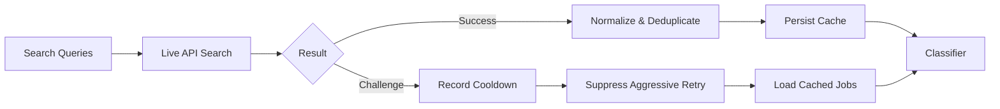

The acquisition layer provides:

- multiple search queries and pages;
- recommended-job acquisition;
- deduplication across sources;
- persistent result caching;
- challenge detection;
- challenge cooldown state;
- cached fallback during temporary search failure;
- orchestration around live and fallback acquisition paths.

Relevant modules:

```text
src/search/
├── challenge_cooldown.py
├── job_cache_codec.py
└── job_search_cache.py
```

---

### 2. Candidate-Aware Job Intelligence

`src/client/job_classifier.py` is not a generic keyword filter.

It evaluates jobs against the target candidate profile and transition strategy.

The classifier handles:

- explicit AI and GenAI relevance;
- applied AI versus incidental AI mentions;
- AI-enabled full-stack transition roles;
- research-primary role vetoes;
- unrealistic executive-scope rejection;
- location compatibility;
- stack conflicts without unnecessary hard rejection;
- seniority compatibility;
- fit-dominant ranking;
- scoring floors for strong applied-AI roles;
- score caching.

Current application subtracks include:

| Subtrack | Purpose |
|---|---|
| `GENAI_LLM` | LLM application engineering, RAG, GenAI systems |
| `AGENTIC_AI` | agent workflows, orchestration, tool-using systems |
| `TRADITIONAL_ML` | suitable applied ML transition opportunities |
| Other classified paths | transition-compatible engineering roles |

---

### 3. Policy and Diversity Engine

The system does not let a ranking score directly trigger unlimited applications.

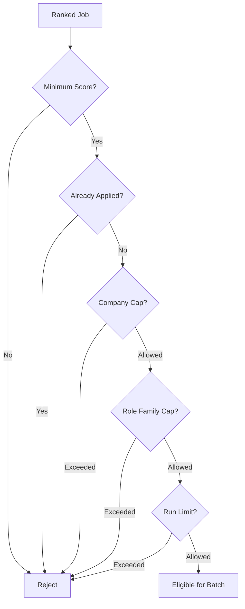

Controls include:

- minimum score gates;
- duplicate application prevention;
- maximum applications per run;
- maximum applications per company;
- role-family concentration limits;
- priority-aware selection;
- subtrack-aware selection;
- dry-run suppression;
- retry-aware execution.

Relevant modules:

```text
src/application/
├── policy.py
├── diversity.py
├── adaptive_strategy.py
├── failure.py
└── outcome.py
```

---

### 4. Hybrid Questionnaire Intelligence

Questionnaires are handled as a constrained resolution problem.

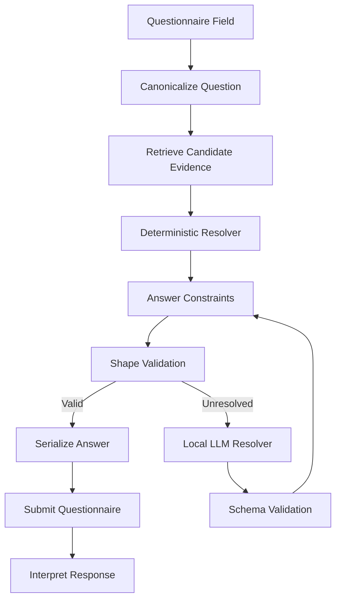

Resolution combines:

1. candidate profile data;
2. candidate evidence retrieval;
3. deterministic matching;
4. canonicalization;
5. allowed-answer constraints;
6. answer-shape validation;
7. local OpenAI-compatible LLM fallback;
8. schema validation;
9. response interpretation;
10. telemetry and raw-response capture for unresolved cases.

Relevant modules:

```text
src/resolution/
├── answer_canonicalizer.py
├── answer_constraints.py
├── answer_shape_validator.py
├── evidence_retriever.py
└── hybrid_resolver.py

src/llm/
├── client.py
├── question_resolver.py
└── schemas.py

config/
├── candidate_profile.py
└── candidate_evidence.py
```

The resolver is designed around candidate-grounded evidence. It should not fabricate qualifications merely to complete an application.

---

### 5. Application Execution and Failure Handling

The executor interprets application responses semantically rather than treating every HTTP response as a binary success or failure.

Recognized outcome categories include:

- applied;
- already applied;
- questionnaire required;
- questionnaire submitted;
- recoverable failure;
- terminal failure;
- validation failure;
- unknown response;
- manual-review case.

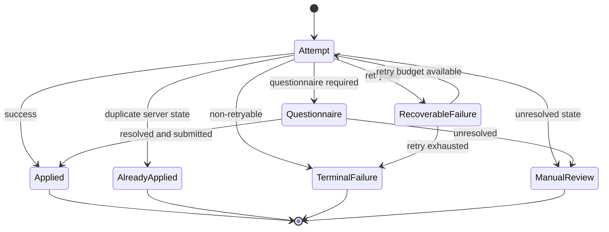

This prevents ambiguous API payloads from being silently counted as successful applications.

---

### 6. Persistent Application Ledger

The SQLite ledger is the durable state layer of the system.

Default database:

```text
data/application_ledger.db
```

It stores:

- job identity and metadata;
- title, company, and location;
- fit score;
- priority tier;
- application subtrack;
- acquisition source;
- local execution status;
- first-seen timestamp;
- last-update timestamp;
- application timestamp;
- failure information;
- server-side status;
- server status timestamp;
- normalized lifecycle stage;
- lifecycle update timestamp;
- per-stage timestamps;
- run summaries;
- append-only status events.

Lifecycle stages:

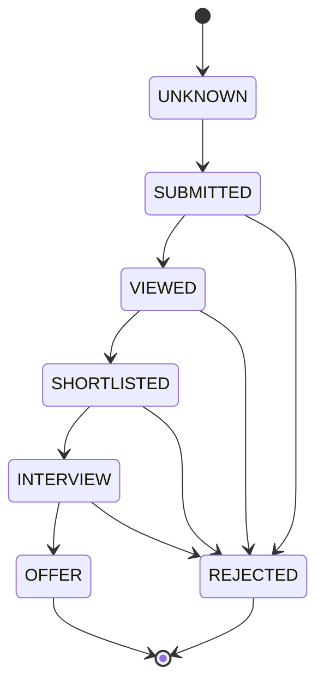

Lifecycle rules protect against accidental regression from a later recruiting stage to an earlier one.

---

### 7. Server-Side Lifecycle Reconciliation

Run:

```bash
python monitor_applications.py
```

The monitor:

1. authenticates;
2. fetches complete application history;
3. parses status history;
4. normalizes server statuses;
5. reconciles existing ledger records;
6. inserts server-only historical applications;
7. records lifecycle transitions;
8. reports stale applications;
9. prints lifecycle funnels.

Example output:

```text
Server applications fetched : 54
New/changed records         : 0

Recruiting lifecycle summary:
  SUBMITTED                53
  REJECTED                  1
  UNKNOWN                   2

Stale applications (>14 days) : 0
```

Repeated runs are designed to be idempotent. Unchanged server history should produce zero changed records.

---

### 8. Application Intelligence

Run:

```bash
python application_report.py
```

The report includes:

- total application count;
- lifecycle distribution;
- response rate;
- interview rate;
- offer rate;
- application velocity;
- application age distribution;
- time to first response;
- adaptive strategy state;
- performance by priority;
- performance by subtrack;
- performance by score band.

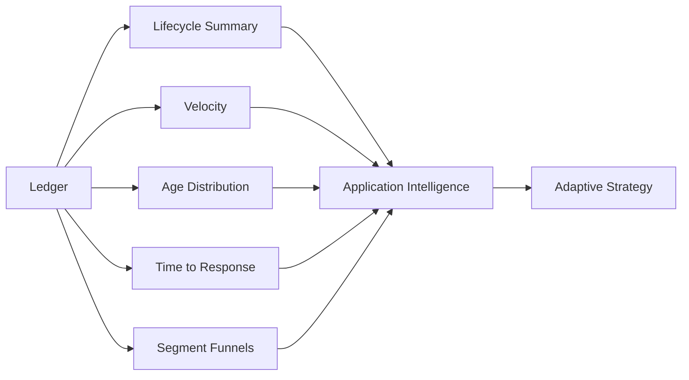

---

## Repository Structure

```text
career-workflow/
├── apply_agent.py                  # Main application orchestrator
├── monitor_applications.py         # Server history + lifecycle reconciliation
├── application_report.py           # Analytics and strategy report
├── README.md
├── requirements.txt
├── .env.example
│
├── assets/
│   └── logo2.svg
│
├── config/
│   ├── candidate_profile.py        # Structured candidate profile
│   └── candidate_evidence.py       # Grounded questionnaire evidence
│
├── src/
│   ├── application/
│   │   ├── adaptive_strategy.py
│   │   ├── analytics.py
│   │   ├── diversity.py
│   │   ├── failure.py
│   │   ├── ledger.py
│   │   ├── lifecycle.py
│   │   ├── outcome.py
│   │   ├── policy.py
│   │   ├── response_classifier.py
│   │   ├── response_interpreter.py
│   │   └── response_store.py
│   │
│   ├── client/
│   │   ├── job_classifier.py
│   │   ├── job_client.py
│   │   ├── naukri_client.py
│   │   └── session.py
│   │
│   ├── llm/
│   │   ├── client.py
│   │   ├── question_resolver.py
│   │   └── schemas.py
│   │
│   ├── resolution/
│   │   ├── answer_canonicalizer.py
│   │   ├── answer_constraints.py
│   │   ├── answer_shape_validator.py
│   │   ├── evidence_retriever.py
│   │   └── hybrid_resolver.py
│   │
│   ├── search/
│   │   ├── challenge_cooldown.py
│   │   ├── job_cache_codec.py
│   │   └── job_search_cache.py
│   │
│   ├── config/
│   ├── exceptions/
│   ├── models/
│   └── utils/
│
├── tools/
│   ├── analyze_jobs.py
│   ├── collect_jobs.py
│   ├── inspect_questionnaire.py
│   ├── inspect_scoring.py
│   ├── inspect_unknown_responses.py
│   ├── inspect_unknown_semantics.py
│   └── score_jobs.py
│
├── tests/
│   ├── application/
│   ├── client/
│   ├── llm/
│   ├── resolution/
│   └── search/
│
├── data/                            # Runtime state, caches, telemetry
├── logs/                            # Runtime logs
└── artifacts/                       # Generated reports and artifacts
```

---

## Quick Start

### 1. Clone and create an environment

```bash
git clone <your-repository-url>
cd career-workflow

python -m venv .venv
source .venv/bin/activate

pip install -r requirements.txt
```

### 2. Configure environment variables

```bash
cp .env.example .env
```

Example:

```env
NAUKRI_USERNAME=your_email@example.com
NAUKRI_PASSWORD=your_password

OMLX_BASE_URL=http://localhost:8000/v1
OMLX_MODEL=your-model-name
OMLX_API_KEY=

MAX_APPLICATIONS_PER_COMPANY_PER_RUN=2
MAX_ROLE_FAMILY_PER_COMPANY=1
```

The LLM endpoint is used as a fallback for unresolved questionnaire cases. Core job acquisition, classification policy, tracking, and analytics remain deterministic modules.

---

## Running the Pipeline

### Safe dry run

```bash
APPLICATION_DRY_RUN=true \
MAX_APPLICATIONS_PER_RUN=1 \
python apply_agent.py
```

This exercises acquisition, classification, scoring, ranking, policy, diversity, and selection without intentionally submitting live applications.

### Controlled live run

```bash
APPLICATION_DRY_RUN=false \
MAX_APPLICATIONS_PER_RUN=1 \
python apply_agent.py
```

### Reconcile recruiting outcomes

```bash
python monitor_applications.py
```

### Generate analytics

```bash
python application_report.py
```

### Full validation

```bash
python -m pytest -q

python -m compileall -q \
  src \
  config \
  tools \
  tests \
  apply_agent.py \
  monitor_applications.py \
  application_report.py

git diff --check
```

---

## Operational Data Model

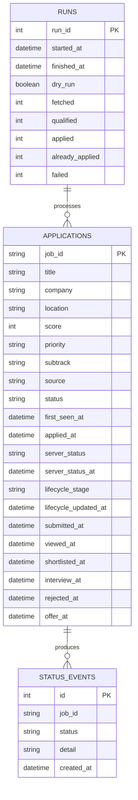

---

## Runtime Artifacts

Typical local runtime state:

```text
data/
├── application_ledger.db
├── applied_jobs.csv
├── job_search_cache.json
├── score_cache.json
├── questionnaire_telemetry.csv
├── raw_jobs.csv
├── scored_jobs.csv
└── responses/
```

| Artifact | Purpose |
|---|---|
| `application_ledger.db` | Authoritative application and lifecycle state |
| `applied_jobs.csv` | Compatibility application log |
| `job_search_cache.json` | Search resilience fallback |
| `score_cache.json` | Reuse previous scoring results |
| `questionnaire_telemetry.csv` | Resolution diagnostics |
| `responses/` | Raw and unresolved API response captures |

Runtime data can contain private application and candidate information and should not be committed to a public repository.

---

## Test Coverage by Domain

The repository contains a domain-organized test suite.

```text
tests/
├── application/    policy, strategy, lifecycle, ledger, analytics, execution
├── client/         login, session, history, direct application flows
├── llm/            local client, schemas, LLM resolver
├── resolution/     constraints, hybrid resolution, telemetry, serialization
└── search/         acquisition, cache, challenge handling, cooldown
```

Major regression areas include:

### Application decisioning

- adaptive strategy activation;
- insufficient-sample protection;
- strategy tightening under weak response performance;
- run-limit expansion under strong response evidence;
- policy enforcement;
- company diversity;
- role-family diversity;
- retry behavior;
- metadata preservation.

### Lifecycle intelligence

- server-status normalization;
- negative-state precedence;
- monotonic lifecycle progression;
- terminal outcomes;
- timestamp preservation;
- history reconciliation;
- idempotent repeated monitoring.

### Search resilience

- successful live acquisition;
- cached fallback;
- challenge detection;
- cooldown behavior;
- orchestration across acquisition sources.

### Questionnaire handling

- deterministic resolution;
- evidence retrieval;
- answer constraints;
- shape validation;
- serialization;
- local LLM fallback;
- unknown-response capture.

---

## Safety and Control Model

Automation is constrained at multiple levels.

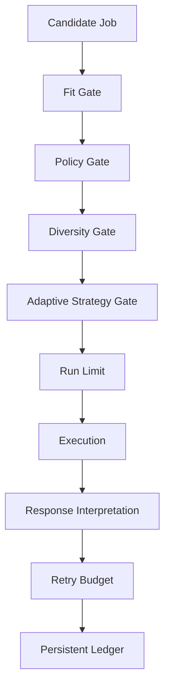

Current controls include:

- dry-run mode;
- explicit live mode;
- per-run application limits;
- per-company limits;
- role-family limits;
- duplicate detection;
- ledger-based state checks;
- server-history reconciliation;
- search cooldown;
- cache fallback;
- retry limits;
- terminal failure states;
- unresolved-question review paths;
- raw response capture;
- evidence thresholds before strategy adaptation.

---

## Network and Session Considerations

The underlying service may associate sessions and search behavior with network identity and anti-abuse signals.

The system therefore assumes:

- session validity can be affected by network changes;
- datacenter-hosted runners can behave differently from residential networks;
- search challenges should cause cooldown rather than rapid retries;
- cached search results are preferable to aggressive retry storms;
- unattended execution should use conservative schedules and application limits;
- credentials, tokens, cookies, candidate evidence, and application history are private data.

The resilience layer exists specifically to make the pipeline fail conservatively rather than repeatedly hammering a challenged endpoint.

---

## Design Principles

### Candidate-grounded automation

Application decisions and questionnaire answers should be based on explicit candidate profile and evidence data.

### Controlled throughput

More applications are not automatically better. Policy, diversity, and strategy layers control where application volume goes.

### Conservative failure semantics

Unknown responses are not assumed to be successes. They are classified, captured, retried only when appropriate, or sent to review.

### Idempotent reconciliation

Running the monitor repeatedly should not create false changes or duplicate lifecycle events.

### Evidence before adaptation

The strategy engine does not overreact to tiny samples.

### Modular boundaries

Acquisition, classification, policy, execution, resolution, tracking, lifecycle reconciliation, analytics, and adaptation remain independently testable.

### Local-first intelligence

Questionnaire LLM fallback can run against a local OpenAI-compatible endpoint.

---

## Evolution

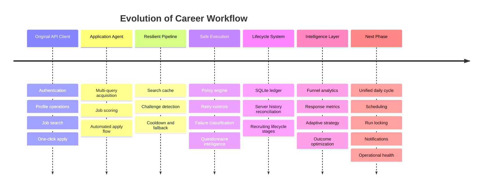

---

## Roadmap

### Foundation

- [x] API authentication and session management
- [x] OTP/MFA support
- [x] profile operations
- [x] API job search
- [x] recommended jobs
- [x] one-click application

### Intelligence

- [x] candidate-aware job classification
- [x] AI relevance gates
- [x] fit scoring and ranking
- [x] score caching
- [x] application subtracks
- [x] application priority tiers

### Resilience

- [x] search result cache
- [x] challenge detection
- [x] cooldown state
- [x] cached fallback
- [x] acquisition orchestration

### Safe Application Execution

- [x] dry-run mode
- [x] run limits
- [x] duplicate prevention
- [x] company diversity
- [x] role-family diversity
- [x] failure classification
- [x] retry policy
- [x] semantic response interpretation

### Questionnaire Intelligence

- [x] candidate evidence model
- [x] evidence retrieval
- [x] deterministic resolver
- [x] canonicalization
- [x] answer constraints
- [x] answer-shape validation
- [x] local LLM fallback
- [x] schema validation
- [x] telemetry
- [x] raw-response capture

### Lifecycle and Analytics

- [x] SQLite application ledger
- [x] status event history
- [x] server application-history reconciliation
- [x] lifecycle normalization
- [x] per-stage timestamps
- [x] stale-application detection
- [x] velocity analytics
- [x] age distribution
- [x] time-to-response measurement
- [x] priority funnel
- [x] subtrack funnel
- [x] score-band performance
- [x] adaptive strategy
- [x] outcome-driven strategy optimization

### Next Operational Phase

- [ ] single-command daily cycle
- [ ] run locking and overlap protection
- [ ] structured runtime logging
- [ ] unattended scheduling
- [ ] failure notifications
- [ ] daily operational summary
- [ ] response-capture retention policy
- [ ] sanitized regression fixtures
- [ ] further decomposition of `apply_agent.py`
- [ ] unified CLI

---

## Origin

Career Workflow is built on top of the Noperi / NopeRi Naukri API client foundation.

The original client provided the low-level capabilities that made this system possible:

- authentication;
- session handling;
- profile operations;
- resume operations;
- search APIs;
- job details;
- application APIs;
- OTP/MFA support.

This fork extends that foundation into a full application intelligence system with resilient acquisition, candidate-aware decisioning, policy and diversity controls, adaptive strategy, questionnaire resolution, failure handling, lifecycle tracking, analytics, and outcome feedback.

Repository history preserves the implementation evolution.

---

## Disclaimer

This project is intended for personal automation of the repository owner's own job-search workflow.

It is not affiliated with Naukri or Info Edge. Users are responsible for reviewing applicable service terms and operating automation conservatively.

Never commit credentials, session tokens, cookies, candidate evidence, raw application responses, or private application history to public source control.

---

<p align="center">
  <strong>Search intelligently. Apply selectively. Track everything. Adapt from evidence.</strong>
</p>
