<p align="center">
  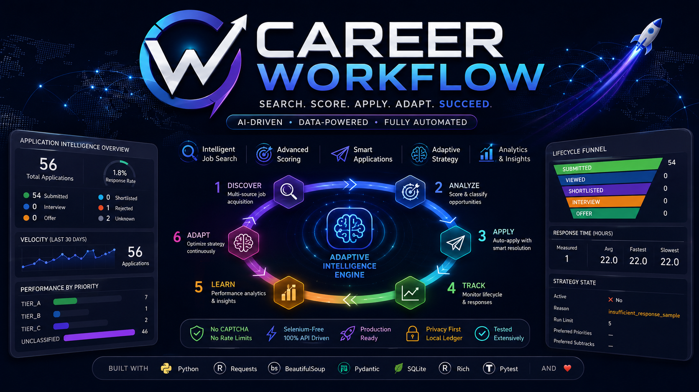
</p>

<h1 align="center">Career Workflow</h1>

<p align="center">
  <strong>AI-Assisted Job Discovery, Evaluation, and Application Orchestration</strong>
</p>

<p align="center">
  A policy-driven automation system for acquiring, evaluating, ranking,
  applying to, tracking, and learning from job opportunities.
</p>

<p align="center">
  
  
  
  
  
  
  
  
  
  
  
</p>

<p align="center">
  <sub>Originally derived from the NopeRi API-client foundation and substantially extended into a policy-driven application orchestration, lifecycle intelligence, and adaptive strategy system.</sub>
</p>

---

## Overview

Career Workflow is a closed-loop job application orchestration system that combines resilient job discovery, candidate-aware qualification, policy-controlled selection, application execution, questionnaire resolution, lifecycle tracking, funnel analytics, and evidence-gated strategy adaptation.

A React-based enterprise operations console sits above these systems, providing one interface for pipeline execution, application operations, run inspection, lifecycle analytics, and runtime diagnostics without replacing the underlying ledger, artifact, or policy layers.

### Current capabilities

- resilient multi-query and multi-page job acquisition with caching and challenge handling;
- candidate-aware AI-role classification, fit scoring, location policy and controlled selection;
- company, role-family and vacancy-level diversity controls;
- direct and questionnaire-based application execution with hybrid deterministic and local-LLM resolution;
- semantic response interpretation, bounded retries and persistent failure handling;
- SQLite-backed application tracking, recruiting lifecycle management and server-history reconciliation;
- funnel analytics, response metrics and evidence-gated adaptive strategy;
- staged pipeline orchestration with structured run artifacts and machine-readable summaries;
- React-based enterprise operations console for pipeline execution, runtime monitoring and workflow management;
- application portfolio, manual-job queue and human-review operations;
- lifecycle, priority, subtrack and execution analytics;
- run inspection, preflight diagnostics, system-health visibility and operational configuration.

It is a closed-loop application system:

```text
DISCOVER → ACQUIRE → QUALIFY → SCORE → RANK → SELECT → APPLY
                                                       │
                                                       ▼
                                              RESOLVE QUESTIONS
                                                       │
                                                       ▼
                                                  TRACK STATE
                                                       │
                                                       ▼
                                              RECONCILE OUTCOMES
                                                       │
                                                       ▼
                                                ANALYZE FUNNEL
                                                       │
                                                       ▼
                                               ADAPT STRATEGY
                                                       │
                                                       └──────► NEXT RUN
```


The system combines API-level automation, candidate-aware job classification, resilient search acquisition, application policy, diversity controls, hybrid questionnaire resolution, retry and failure handling, persistent lifecycle tracking, funnel analytics, and evidence-gated adaptive strategy.

The objective is not maximum application volume.

The objective is a controlled system that sends better applications, avoids repeated mistakes, survives partial failures, observes recruiting outcomes, and changes strategy only when enough evidence exists.

---

## Daily Operations

```text
Start UI
↓
Start Scheduler
↓
Review Queue
↓
Review Manual Queue
↓
Scheduler applies jobs
↓
Monitor Applications
↓
Review Analytics
```

---

## System at a Glance

| Layer | What it does | State |
|---|---|:---:|
| Authentication | Session login, bearer token, cookies, OTP/MFA | ✅ |
| Search | Multi-query, multi-experience, paginated API acquisition | ✅ |
| Search termination | Empty-page, partial-page, repeated-page and challenge stop conditions | ✅ |
| Resilience | Search cache, challenge detection, cooldown, partial-result preservation and fallback | ✅ |
| Classification | AI relevance, title quality, red flags, candidate fit and transition-role compatibility | ✅ |
| Work-mode policy | Remote-anywhere; office/hybrid/unknown only when Pune-compatible | ✅ |
| Ranking | LLM-assisted fit scoring, deterministic guards and score caching | ✅ |
| Policy | Thresholds, duplicate prevention, run limits and dry-run controls | ✅ |
| Diversity | Company, role-family and vacancy-fingerprint concentration control | ✅ |
| Strategy | Evidence-gated adaptive thresholds and allocation | ✅ |
| Execution | Direct application and questionnaire application flows | ✅ |
| Resolution | Deterministic evidence + constraints + LLM fallback | ✅ |
| Failure handling | Response interpretation, retry policy, terminal states | ✅ |
| Ledger | SQLite state, event history, run summaries | ✅ |
| Monitoring | Server application-history reconciliation | ✅ |
| Lifecycle | Submitted → Viewed → Shortlisted → Interview → Outcome | ✅ |
| Analytics | Velocity, age, response time, funnel and segment performance | ✅ |
| Control plane | React Operations Console for execution, inspection and workflow management | ✅ |
| Pipeline operations | Dry-run/live launch controls, bounded execution and runtime inspection | ✅ |
| Run inspection | Immutable artifact history, stage state and diagnostic evidence | ✅ |
| System health | Runtime, storage, configuration and integration diagnostics | ✅ |
| Automation | Daemon scheduler with runtime recovery, locking, heartbeat and interactive workstation mode | ✅ |
| Runtime | Process state, lock management, recovery, watchdog and heartbeat | ✅ |
| Observability | Stage metrics, rejection analytics, runtime artifacts and execution reports | ✅ |

---

## Operations Control Plane

Career Workflow includes a React-based operations console for running and inspecting the application system without collapsing operational state into a collection of terminal commands.

The interface is deliberately built as an operations console rather than a decorative analytics dashboard.

```text
COMMAND CENTER
    │
    ├── live process truth
    ├── latest artifact state
    ├── application portfolio
    ├── execution map
    ├── lifecycle funnel
    └── recent run history

PIPELINE CONTROL
    │
    ├── dry-run / live execution mode
    ├── application safety ceiling
    ├── process launch and termination
    ├── runtime state
    ├── stage progression
    └── process output

WORKSPACE
    │
    ├── jobs
    ├── applications
    ├── manual queue
    └── review queue

INSPECTION
    │
    ├── analytics
    ├── run inspector
    └── system health

SYSTEM
    │
    └── settings
```

### Operational surfaces

| Surface | Purpose |
|---|---|
| Command Center | Single-screen operational overview of process truth, artifact state, throughput, execution progression and recent runs |
| Pipeline | Configure, launch and inspect dry-run or live pipeline executions |
| Jobs | Inspect acquired and classified job inventory |
| Applications | Browse application portfolio and lifecycle state |
| Manual Queue | Manage manually sourced opportunities |
| Review Queue | Inspect and resolve automated shortlists directly (Mark Reviewed, Dismiss, Open Posting) |
| Analytics | Inspect lifecycle conversion, response velocity, priority performance and subtrack performance |
| Run Inspector | Examine immutable run artifacts and execution evidence |
| System Health | Run preflight diagnostics across runtime, storage and integration dependencies |
| Settings | Inspect operational configuration and runtime policy |

### State semantics

The control plane distinguishes three different kinds of truth:

```text
PROCESS STATE
    what the launcher-owned process is doing now

ARTIFACT STATE
    what the latest immutable run artifact records

PORTFOLIO STATE
    what the persistent application ledger records over time
```

This separation prevents a terminated or abandoned historical artifact from being presented as a currently running pipeline.

For example:

```text
Process:   IDLE
Artifact:  ORPHANED
Portfolio: 147 applications
```

is a valid state. It means no pipeline process is active, the latest run artifact was left without a terminal result, and the persistent portfolio remains intact.

### Runtime Components

The scheduler coordinates several runtime services.

- Runtime State Manager
- Pipeline Lock
- Heartbeat Manager
- Run Manager
- Recovery Manager
- Watchdog
- Circuit Breaker

These services provide:

- single active pipeline instance
- stale lock recovery
- heartbeat monitoring
- crash recovery
- orphaned run detection
- graceful shutdown
- runtime state persistence

### UI architecture

The UI is intentionally thin over the existing application and operational services:

```text
React / Vite / Tailwind
      ↓
Control-Center Service Adapter (FastAPI)
      ↓
Existing Pipeline / Ledger / Analytics / Diagnostics
      ↓
SQLite + Run Artifacts + Runtime Process State
```

The UI does not maintain a second application truth model. Existing ledger, artifact, diagnostic, runner and workflow services remain authoritative.

---

## Architecture

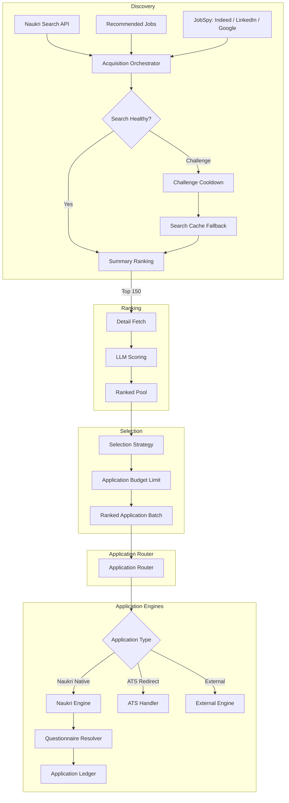

---

## Closed-Loop Strategy

The defining feature of the system is the feedback loop.

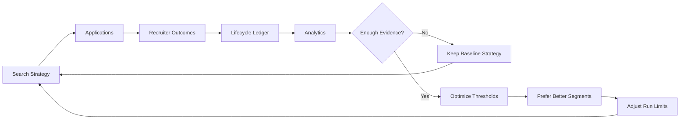

Adaptive behavior is deliberately evidence-gated. A rejection or two does not cause the system to thrash. Strategy changes only after sufficient outcome evidence exists.

Current adaptive controls include:

- minimum score threshold;
- maximum applications per run;
- preferred priority tiers;
- preferred role subtracks;
- allocation toward stronger-performing segments.

---

## Why This Is Different From a Basic Auto-Apply Bot

A basic bot:

```text
search → keyword match → apply → repeat
```

Career Workflow:

```text
resilient acquisition
        ↓
candidate-aware classification
        ↓
fit scoring + AI relevance gates
        ↓
application policy
        ↓
company + role-family diversity
        ↓
adaptive strategy
        ↓
safe execution
        ↓
questionnaire intelligence
        ↓
response interpretation
        ↓
failure classification + retry
        ↓
persistent application ledger
        ↓
server lifecycle reconciliation
        ↓
funnel analytics
        ↓
outcome-driven strategy feedback
```

This distinction matters. The system treats job application as a decision pipeline with state and feedback, not a loop over search results.

---

## Core Capabilities

### 1. Resilient Job Acquisition

Search acquisition is built to degrade safely.

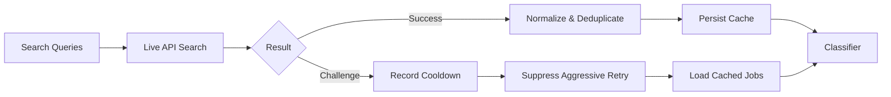

The acquisition layer is a bounded search matrix rather than a single search call.

```text
search queries
    × experience buckets
    × result pages
    × configured locations
        ↓
live search requests
        ↓
cross-query / cross-page deduplication
        ↓
partial-result preservation
        ↓
cache merge and source attribution
```

Current acquisition capabilities include:

- a broad portfolio of AI, GenAI, LLM, RAG, agentic AI, ML, MLOps, NLP, computer-vision and AI-enabled full-stack search families;
- configurable experience buckets instead of a single hard-coded experience search;
- configurable pagination depth;
- per-page result sizing;
- deduplication across overlapping queries, experience buckets and pages;
- early termination on empty result pages;
- early termination on partial terminal pages;
- repeated-page fingerprint detection to prevent useless pagination loops;
- persistent search-result caching with TTL;
- source attribution for live-only, cache-only and live-plus-cache jobs;
- challenge detection with partial results preserved;
- persistent challenge cooldown state;
- suppression of aggressive live search during cooldown;
- explicit bypass of challenge cooldown via `--force-live`;
- cached fallback when live search cannot continue;
- acquisition telemetry including request count, challenge state and source composition.

A real broad dry run can acquire hundreds of unique jobs before downstream gates. The pipeline is intentionally recall-oriented at acquisition time: broad discovery happens first, while expensive detail fetching, scoring and application execution happen only after progressively stronger gates.

Relevant modules:

```text
src/search/
├── challenge_cooldown.py
├── job_cache_codec.py
└── job_search_cache.py
```

---

### 2. Candidate-Aware Job Intelligence

`src/client/job_classifier.py` is not a generic keyword filter.

It evaluates jobs against the target candidate profile and transition strategy.

The classification pipeline is deliberately staged so cheap deterministic rejection happens before expensive full-JD scoring.

```text
raw jobs
    ↓ normalize
deduplicate
    ↓
hard vetoes
    ↓
title-quality filter
    ↓
company vetoes
    ↓
AI relevance gate
    ↓
detail-fetch budget and diversity allocation
    ↓
full JD red-flag analysis
    ↓
structured work-mode + location policy
    ↓
LLM-assisted fit scoring
    ↓
post-score deterministic guards
    ↓
ranked candidates
```

The classifier handles:

- explicit AI, GenAI, LLM, RAG, agentic AI and applied-ML relevance;
- genuine AI engineering versus incidental AI terminology;
- AI-enabled full-stack and backend transition roles;
- non-software title rejection;
- research-primary and unrealistic executive-scope vetoes;
- candidate-aware stack overlap;
- stack mismatch as a ranking factor rather than a default hard rejection;
- experience requirements as ranking context rather than a blanket local veto;
- seniority and role-scope compatibility;
- full-JD red-flag detection;
- structured work-mode inference;
- false-positive protection for phrases such as `remote sensing`;
- fit-dominant LLM-assisted scoring;
- deterministic post-score guards;
- score caching and evidence-based score explanations.

The current candidate strategy encoded by the system is intentionally broad:

> Genuine AI-related roles remain eligible even when the exact stack is imperfect. Stack fit changes ranking priority; it normally does not eliminate the opportunity.

Location policy is asymmetric by design:

| Work mode | Eligibility rule |
|---|---|
| Remote | Eligible regardless of geography |
| Office | Eligible only when Pune-compatible |
| Hybrid | Eligible only when Pune-compatible |
| Unknown | Conservatively eligible only when Pune-compatible |

This prevents a broad national search from turning into applications for office-bound roles in unrelated cities while retaining globally remote opportunities.

Current application subtracks include:

| Subtrack | Purpose |
|---|---|
| `GENAI_LLM` | LLM application engineering, RAG, GenAI systems |
| `AGENTIC_AI` | agent workflows, orchestration, tool-using systems |
| `TRADITIONAL_ML` | suitable applied ML transition opportunities |
| Other classified paths | transition-compatible engineering roles |

---

### 3. Policy and Diversity Engine

The system does not let a ranking score directly trigger unlimited applications.

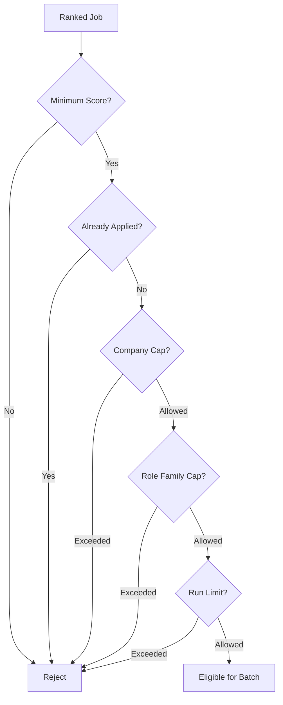

Controls include:

- configurable minimum score gates;
- duplicate application prevention;
- maximum applications per run;
- maximum applications per company per run;
- role-family concentration limits;
- vacancy-fingerprint deduplication;
- same-company/same-family concentration protection;
- bounded detail-fetch allocation by company and role family;
- priority-aware selection;
- subtrack-aware selection;
- deterministic exploration/exploitation allocation;
- dry-run suppression;
- retry-aware execution.

Vacancy fingerprints solve a problem that ordinary job-ID deduplication cannot: employers may publish many technically distinct listings representing the same underlying vacancy. The diversity layer can collapse or cap those duplicates before they consume application capacity or detail-fetch budget.

Relevant modules:

```text
src/application/
├── policy.py
├── diversity.py
├── adaptive_strategy.py
├── failure.py
└── outcome.py
```

---

### 4. Hybrid Questionnaire Intelligence

Questionnaires are handled as a constrained resolution problem.

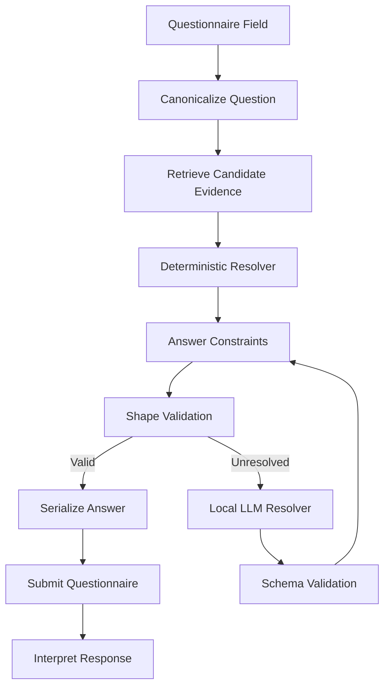

Resolution combines:

1. candidate profile data;
2. candidate evidence retrieval;
3. deterministic matching;
4. canonicalization;
5. allowed-answer constraints;
6. answer-shape validation;
7. local OpenAI-compatible LLM fallback;
8. schema validation;
9. response interpretation;
10. telemetry and raw-response capture for unresolved cases.

Relevant modules:

```text
src/resolution/
├── answer_canonicalizer.py
├── answer_constraints.py
├── answer_shape_validator.py
├── evidence_retriever.py
└── hybrid_resolver.py

src/llm/
├── client.py
├── question_resolver.py
└── schemas.py

config/
├── candidate_profile.py
└── candidate_evidence.py
```

The resolver is designed around candidate-grounded evidence. It should not fabricate qualifications merely to complete an application.

---

### 5. Application Execution and Failure Handling

The executor interprets application responses semantically rather than treating every HTTP response as a binary success or failure.

Recognized outcome categories include:

- applied;
- already applied;
- questionnaire required;
- questionnaire submitted;
- recoverable failure;
- terminal failure;
- validation failure;
- unknown response;
- manual-review case.

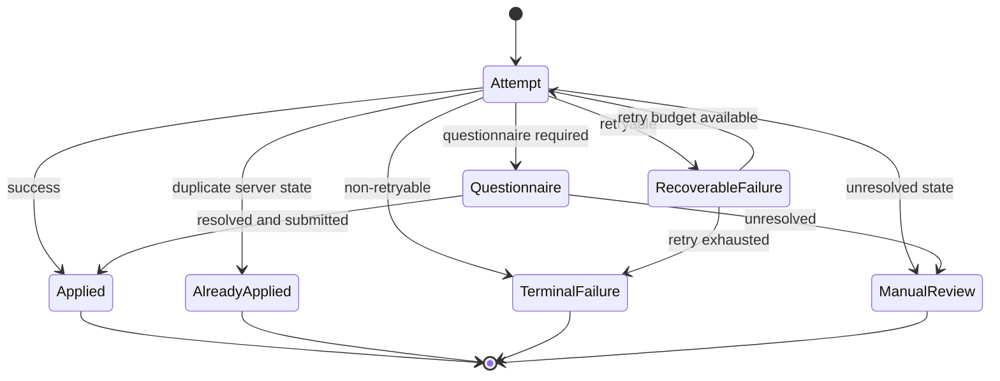

This prevents ambiguous API payloads from being silently counted as successful applications.

---

### 6. Persistent Application Ledger

The SQLite ledger is the durable state layer of the system and the single source of truth for all application state.

Default database:

```text
data/application_ledger.db
```

It stores:

- job identity and metadata;
- title, company, and location;
- fit score;
- priority tier;
- application subtrack;
- acquisition source;
- local execution status;
- first-seen timestamp;
- last-update timestamp;
- application timestamp;
- failure information;
- server-side status;
- server status timestamp;
- normalized lifecycle stage;
- lifecycle update timestamp;
- per-stage timestamps;
- run summaries;
- append-only status events.

Lifecycle stages:

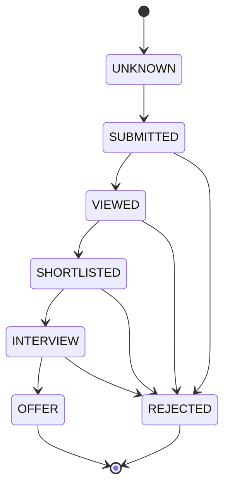

Lifecycle rules protect against accidental regression from a later recruiting stage to an earlier one.

---

### 7. Server-Side Lifecycle Reconciliation

Run:

```bash
python monitor_applications.py
```

The monitor:

1. authenticates;
2. fetches complete application history;
3. parses status history;
4. normalizes server statuses;
5. reconciles existing ledger records;
6. inserts server-only historical applications;
7. records lifecycle transitions;
8. reports stale applications;
9. prints lifecycle funnels.

Example output:

```text
Server applications fetched : 54
New/changed records         : 0

Recruiting lifecycle summary:
  SUBMITTED                53
  REJECTED                  1
  UNKNOWN                   2

Stale applications (>14 days) : 0
```

Repeated runs are designed to be idempotent. Unchanged server history should produce zero changed records.

---

### 8. Application Intelligence

Run:

```bash
python application_report.py
```

The report includes:

- total application count;
- lifecycle distribution;
- response rate;
- interview rate;
- offer rate;
- application velocity;
- application age distribution;
- time to first response;
- adaptive strategy state;
- performance by priority;
- performance by subtrack;
- performance by score band.

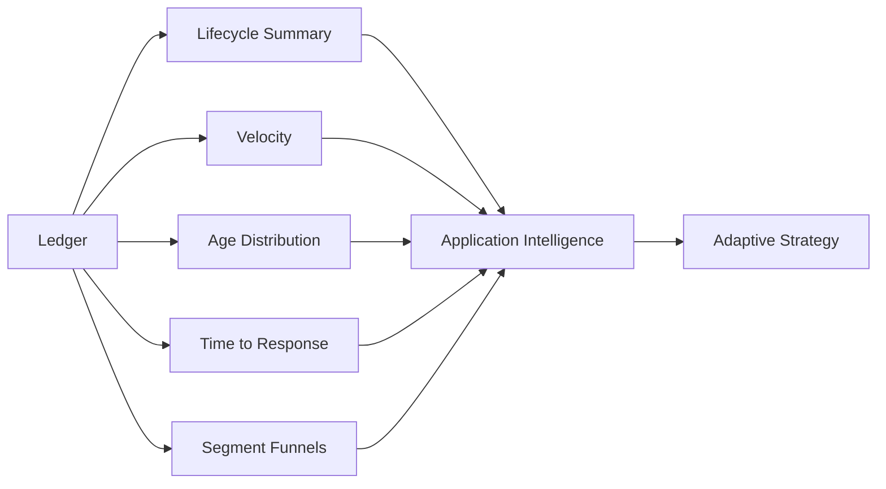

---

## Repository Structure

```text
career-workflow/
├── run_pipeline.py
├── apply_agent.py
├── monitor_applications.py
├── application_report.py
├── README.md
├── requirements.txt
├── .env.example
│
├── frontend/                       # Modern React + Vite operations console
│   ├── src/
│   ├── package.json
│   └── vite.config.ts
│
├── control_center/                 # Framework-independent operational services
│   ├── data.py
│   ├── runner.py
│   ├── diagnostics.py
│   ├── run_inspector.py
│   ├── manual_jobs.py
│   ├── analytics_helpers.py
│   └── workflows.py
│
├── assets/
├── config/
│   ├── candidate_profile.py
│   └── candidate_evidence.py
│
├── src/
│   ├── application/
│   ├── client/
│   ├── llm/
│   ├── resolution/
│   ├── search/
│   ├── config/
│   ├── exceptions/
│   ├── models/
│   └── utils/
│
├── tools/
├── tests/
│   ├── application/
│   ├── client/
│   ├── llm/
│   ├── resolution/
│   └── search/
│
├── data/
├── logs/
└── artifacts/
```

---

## Quick Start

### 1. Clone and create an environment

```bash
git clone https://github.com/your-username/career-workflow.git
cd career-workflow

python -m venv .venv
source .venv/bin/activate

pip install -r requirements.txt
```

### 2. Configure environment variables

```bash
cp .env.example .env
```

Example:

```env
NAUKRI_USERNAME=your_email@example.com
NAUKRI_PASSWORD=your_password

OMLX_BASE_URL=http://localhost:8000/v1
OMLX_MODEL=your-model-name
OMLX_API_KEY=

MAX_APPLICATIONS_PER_COMPANY_PER_RUN=2
MAX_ROLE_FAMILY_PER_COMPANY=1
```

The LLM endpoint is used as a fallback for unresolved questionnaire cases. Core job acquisition, classification policy, tracking, and analytics remain deterministic modules.

### 3. Launch the Operations Control Plane

Start the backend API server:

```bash
uvicorn api.main:app --reload
```

In a new terminal window, start the React frontend:

```bash
cd frontend
npm install
npm run dev
```

The control plane provides the primary operational interface for pipeline execution, runtime inspection, application portfolio review, manual and review queues, lifecycle analytics, run artifact inspection, system diagnostics, and runtime configuration visibility.

The CLI entry points remain available for automation, debugging and direct operational use.

---

### Command Line Reference

```bash
run_pipeline.py

--live
    Enables real application submission.

--confirm-live APPLY_LIVE
    Required confirmation token for live execution.

--provider
    all | naukri | jobspy

--acquisition-mode
    full | incremental

--force-live
    Ignores recorded acquisition cooldowns and performs a live search.

--max-applications
    Optional execution ceiling.
    Omit for unlimited policy-controlled execution.

--canary
    Automatically limits a live execution to one application.
```

---

## Running the Pipeline

`run_pipeline.py` is the staged orchestration entry point. `apply_agent.py` contains acquisition and application-domain functionality used by the pipeline.

## Scheduler

Career Workflow supports two execution models.

### Daemon Mode (Production)

Runs continuously using the configured schedule.

```bash
python run_scheduler.py
```

Behavior:

- waits until the configured full-run window
- executes incremental searches using the configured interval
- intended for always-on systems
- graceful shutdown with Ctrl+C

---

### Interactive Mode (Workstation)

Optimized for running on a local development machine.

```bash
python run_scheduler.py --interactive
```

Behavior:

- immediately performs a full pipeline run
- stays alive after completion
- performs incremental searches every 30 minutes by default
- continues until Ctrl+C

---

### Interactive Session

Automatically terminates after a work session.

```bash
python run_scheduler.py \
    --interactive \
    --session-hours 2
```

Example:

09:00 Full Run

09:30 Incremental

10:00 Incremental

10:30 Incremental

11:00 Scheduler exits automatically

---

### Custom Incremental Interval

```bash
python run_scheduler.py \
    --interactive \
    --incremental 20
```

Only interactive mode uses this override.

Daemon mode always follows the configured schedule.

---

### Immediate Execution

A full run is automatically performed when interactive mode starts.

This eliminates waiting for the next scheduled execution during local development.

### Full Live Run / Production Execution

Executes a full live acquisition across all configured providers and applies to every job that survives ranking, policy, diversity and safety constraints. No artificial application limit is imposed.

```bash
python run_pipeline.py \
  --live \
  --confirm-live APPLY_LIVE \
  --acquisition-mode full \
  --provider all \
  --force-live
```

### Capture the production live run

```bash
RUN_ID=$(date +%Y%m%d_%H%M%S)

mkdir -p artifacts/live_runs/${RUN_ID}

history | tail -1 \
> artifacts/live_runs/${RUN_ID}/command.txt

python run_pipeline.py \
  --live \
  --confirm-live APPLY_LIVE \
  --provider all \
  --acquisition-mode full \
  --force-live \
  2>&1 | tee artifacts/live_runs/${RUN_ID}/terminal.log

echo $? > artifacts/live_runs/${RUN_ID}/exit_code.txt

perl -pe 's/\e\[[0-9;]*[A-Za-z]//g' \
  artifacts/live_runs/${RUN_ID}/terminal.log \
  > artifacts/live_runs/${RUN_ID}/terminal_clean.log
```

### Broad validation dry run

```bash
python run_pipeline.py \
    --max-applications 50
```

A broad dry run exercises the complete staged pipeline without submitting applications:

```text
PREFLIGHT
    ↓
ACQUISITION
    ↓
CLASSIFICATION
    ↓
SELECTION
    ↓
APPLICATION (suppressed by dry-run policy)
    ↓
RECONCILIATION
    ↓
STRATEGY
    ↓
REPORT
```

The run summary records stage status and execution counters:

```json
{
  "status": "SUCCESS",
  "acquired": 799,
  "classified": 35,
  "selected": 35,
  "attempted": 0,
  "submitted": 0,
  "dry_run_skipped": 35,
  "failed": 0
}
```

The exact counts depend on live search results, cache state and configured search breadth. The example demonstrates the intended funnel shape: broad acquisition followed by aggressive qualification.

### Small live canary

```bash
python run_pipeline.py \
  --live \
  --confirm-live APPLY_LIVE \
  --max-applications 3
```

Use small live batches while validating questionnaire handling, response interpretation, ledger writes and server reconciliation.

### Controlled live run

```bash
python run_pipeline.py \
  --live \
  --confirm-live APPLY_LIVE \
  --max-applications 15
```

`--max-applications` is a safety ceiling, not an application target. The pipeline may select fewer jobs when fewer candidates survive qualification and policy.

### Reconcile recruiting outcomes

```bash
python monitor_applications.py
```

### Generate analytics

```bash
python application_report.py
```

## Validation

Complete validation:

```bash
python -m pytest
```

Scheduler:

```bash
python -m pytest tests/orchestration -v
```

Application:

```bash
python -m pytest tests/application -v
```

Interactive scheduler:

```bash
python -m pytest tests/orchestration/test_scheduler_interactive.py
```

Formatting:

```bash
git diff --check
```

Current validation status:

- 481 backend tests passing
- Scheduler runtime tests passing
- Interactive scheduler tests passing
- Application tests passing
---

## Factory Reset (Fresh Start)

Use this procedure when you want to discard all runtime state and begin with a completely fresh portfolio.

> **Warning**
>
> This permanently removes local application history, cached search results, runtime state, run artifacts, logs, and generated data. Only use it when intentionally starting from scratch.

```bash
# Stop the UI and scheduler first.

rm -rf artifacts/runs/*
rm -rf logs/*

rm -f data/application_ledger.db
rm -f data/job_search_cache.json
rm -f data/score_cache.json
rm -f data/manual_jobs.db
rm -f data/manual_action_queue.json
rm -f data/search_challenge_state.json
rm -f data/runtime_state.json
rm -f data/scheduler_state.json
rm -f data/pipeline_state.json
rm -f data/heartbeat.json

rm -rf data/ui_runtime/*
rm -rf data/responses/*

mkdir -p artifacts/runs logs data/responses data/ui_runtime

echo "Factory reset complete."
```

After the reset:

1. Start the Operations Control Plane.
2. Start the scheduler (or run a manual pipeline).
3. A fresh application ledger, artifacts, caches, and runtime state will be created automatically.

---

## Operating Model

The system is designed for different execution modes rather than one permanently aggressive setting.

| Mode | Purpose | Typical ceiling |
|---|---|---:|
| Broad dry run | Validate acquisition, classification and selection behavior | 500 |
| Live canary | Validate real execution and questionnaire behavior | 1–3 |
| Controlled live batch | Normal application operation after canary validation | 10–25 |
| Reconciliation | Import server-side recruiter/application state | N/A |
| Analytics | Inspect funnel health and adaptive strategy | N/A |

A normal operating cycle is:

```text
1. Broad or incremental acquisition
2. Classification and ranking
3. Controlled application batch
4. Persist local outcomes
5. Reconcile server history
6. Inspect lifecycle funnel
7. Allow adaptive strategy only when evidence thresholds are met
```

The system does not assume every run should exhaust its configured application limit. Eligibility, diversity and available fresh supply determine the actual batch size.

---

### Provider Selection

The pipeline supports multi-provider execution, allowing you to run Naukri and JobSpy independently or together.

```bash
# Run both providers (default if enabled in config)
python run_pipeline.py \
    --acquisition-mode full \
    --provider all

# Run only Naukri
python run_pipeline.py \
    --provider naukri

# Run only JobSpy
python run_pipeline.py \
    --provider jobspy
```

#### Supported Providers & Prioritization

The acquisition layer supports:
- **Naukri**: Native authenticated API client (primary channel for direct apply flows).
- **JobSpy**: Non-authenticated scraping provider (`python-jobspy` wrapper) supporting:
  - **Indeed** (Priority 1: Stable, high yield, supports keyword exclusion queries)
  - **LinkedIn** (Priority 2: Stable guest-scraping, moderate yield)
  - **Google Jobs** (Priority 3: Best effort, prone to upstream parser/markup changes)

You can configure the active providers and search priorities under `profiles` in `config/search_strategy.yaml`:
```yaml
profiles:
  aggressive:
    providers: ["indeed", "linkedin", "google"]
```

#### Provider Health & Degradation Safeguards

To prevent unstable job boards from exhausting network resources or blocking the pipeline, the system tracks provider health at runtime:
- **Degradation Detection**: If a site (such as Google Jobs) returns `0` results or raises scraper exceptions for **3 consecutive queries**, it is marked as `degraded` for the current execution.
- **Resilient Execution**: The remaining queries for the degraded site are skipped, and the acquisition pipeline continues with other healthy sites (Indeed, LinkedIn) without raising terminal exceptions.
- **Interleaved Budgeting**: In `benchmarking_mode`, queries are interleaved across providers (e.g. Indeed Q1 -> LinkedIn Q1 -> Google Q1 -> Indeed Q2 ...) to ensure a single degraded site cannot monopolize the benchmark quota.
- **Telemetry Visibility**: Provider health statuses are written directly to `acquisition.json` and logged in pipeline runs.

### Acquisition Mode vs Cache Policy

Acquisition depth is controlled by the mode (`full` or `incremental`).

By default, if Naukri presents a CAPTCHA or blocking challenge, the orchestrator records a cooldown and falls back to cached results to avoid banning your IP. This safety mechanism is active regardless of acquisition mode.

To explicitly bypass a recorded cooldown and force a live search, use `--force-live`:

```bash
# Respects cooldown if active
python run_pipeline.py --acquisition-mode full

# Ignores cooldown and forces a live search attempt
python run_pipeline.py --acquisition-mode full --force-live

# Actually run the pipeline with maximum eligible applications
python run_pipeline.py \
  --live \
  --confirm-live APPLY_LIVE \
  --acquisition-mode full \
  --provider all \
  --force-live
```

---

## Progressive Cost Control

The pipeline orders work so expensive operations are concentrated on plausible candidates.

```text
CHEAP / BROAD
    search acquisition
    normalization
    deduplication
    title and hard vetoes
    AI relevance gate
        ↓
MODERATE / NARROWER
    detail-fetch budgeting
    full JD retrieval
    red-flag analysis
    work-mode and location policy
        ↓
EXPENSIVE / SMALL SET
    fit scoring
    application execution
    questionnaire resolution
    local LLM fallback
```

This matters for local-first operation. A broad search can discover hundreds of jobs, but the local model is not invoked for every acquired result. Questionnaire LLM inference is a fallback path for unresolved application fields, not the default processing path for the entire search corpus.

---

## Configuration Surface

The runtime behavior is controlled primarily through `.env` and the CLI safety ceiling.

Representative controls:

```env
APPLICATION_DRY_RUN=true
MAX_APPLICATIONS_PER_RUN=10

JOB_SEARCH_CACHE_PATH=data/job_search_cache.json
JOB_SEARCH_CACHE_TTL_DAYS=3

SEARCH_CHALLENGE_STATE_PATH=data/search_challenge_state.json
SEARCH_CHALLENGE_COOLDOWN_MINUTES=60

ADAPTIVE_STRATEGY_ENABLED=true
ADAPTIVE_MIN_APPLICATIONS=30
ADAPTIVE_MIN_RESPONSES=5
ADAPTIVE_MIN_GROUP_SAMPLES=5
ADAPTIVE_EXPLORATION_FRACTION=0.20

AUTO_APPLY_MIN_SCORE=70

DETAIL_FETCH_BUDGET=100
DETAIL_BUDGET_MAX_PER_COMPANY=5
DETAIL_BUDGET_MAX_PER_FAMILY=2

MAX_APPLICATIONS_PER_COMPANY_PER_RUN=2
MAX_ROLE_FAMILY_PER_COMPANY=1
MAX_PER_VACANCY_FINGERPRINT=1
```

These values are operational policy, not universal recommendations. The repository keeps the mechanism configurable so search breadth, detail-fetch cost, application throughput and diversity constraints can evolve independently.

---

## Observability and Run Summaries

Every staged run produces a machine-readable summary with:

- run ID;
- overall status;
- acquired count;
- classified count;
- selected count;
- attempted count;
- submitted count;
- already-applied count;
- local and external skips;
- policy rejections;
- dry-run suppressions;
- run-limit suppressions;
- failures;
- manual-review count;
- start and completion timestamps;
- per-stage status;
- captured errors.

This makes pipeline behavior auditable. A successful dry run can prove that all stages completed while still showing `attempted: 0` and `submitted: 0`, distinguishing execution correctness from live side effects.


## Pipeline Observability

Every run produces structured operational metrics.

Recorded metrics include:

- jobs acquired
- deterministic rejection breakdown
- jobs sent to AI scoring
- qualified jobs
- attempted applications
- successful applications
- already applied jobs
- manual review jobs
- policy rejections
- stage execution status
- pipeline runtime
- latency breakdown

Example:

```text
Jobs discovered: 712

Rejected:
- Non-AI
- Title Filter
- Hard Veto
- Experience
- Red Flag

Sent to AI: 45
Qualified: 44
Applied: 20

Pipeline runtime: 7m 2s
Average/job: 9.4s
```

---

## Operational Data Model

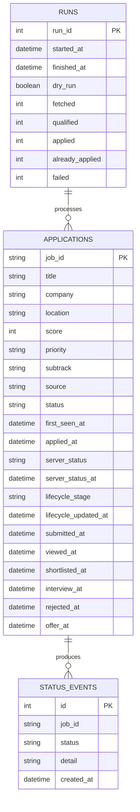

---

## Runtime Artifacts

Typical local runtime state:

```text
data/
├── application_ledger.db
├── job_search_cache.json
├── score_cache.json
├── questionnaire_telemetry.csv
├── raw_jobs.csv
├── scored_jobs.csv
└── responses/
```

| Artifact | Purpose |
|---|---|
| `application_ledger.db` | Authoritative application and lifecycle state |
| `job_search_cache.json` | Search resilience fallback |
| `score_cache.json` | Reuse previous scoring results |
| `questionnaire_telemetry.csv` | Resolution diagnostics |
| `responses/` | Raw and unresolved API response captures |

### Pipeline Artifacts (`artifacts/runs/<run_id>/`)

| Artifact | Purpose |
|---|---|
| `manifest.json` | Run metadata, timestamp, and status |
| `timeline.json` | Execution stage durations |
| `environment.json` | Execution context and policies |
| `diagnostics.json` | System state and health |
| `classification.json` | Core classification stage summary |
| `selection.json` | Selection stage summary |
| `application.json` | Application stage summary |
| `selected_jobs.json` | Jobs selected for application with decision history |
| `rejected_jobs.json` | All rejected jobs with rejection stage, code, and reason |
| `applied_jobs.json` | Successfully applied jobs for this run |
| `already_applied.json` | Jobs skipped due to duplicate application state |
| `external_apply.json` | Jobs requiring external application |
| `manual_review.json` | Jobs flagged for human review |

Runtime data can contain private application and candidate information and should not be committed to a public repository.

---

## Test Coverage by Domain

The repository contains a domain-organized test suite.

```text
tests/
├── application/    policy, strategy, lifecycle, ledger, analytics, execution
├── client/         login, session, history, direct application flows
├── llm/            local client, schemas, LLM resolver
├── resolution/     constraints, hybrid resolution, telemetry, serialization
└── search/         acquisition, cache, challenge handling, cooldown
```

Major regression areas include:

### Application decisioning

- adaptive strategy activation;
- insufficient-sample protection;
- strategy tightening under weak response performance;
- run-limit expansion under strong response evidence;
- policy enforcement;
- company diversity;
- role-family diversity;
- retry behavior;
- metadata preservation.

### Lifecycle intelligence

- server-status normalization;
- negative-state precedence;
- monotonic lifecycle progression;
- terminal outcomes;
- timestamp preservation;
- history reconciliation;
- idempotent repeated monitoring.

### Search resilience

- successful live acquisition;
- cached fallback;
- challenge detection;
- cooldown behavior;
- orchestration across acquisition sources.

### Questionnaire handling

- deterministic resolution;
- evidence retrieval;
- answer constraints;
- shape validation;
- serialization;
- local LLM fallback;
- unknown-response capture.

---

## Safety and Control Model

Automation is constrained at multiple levels.

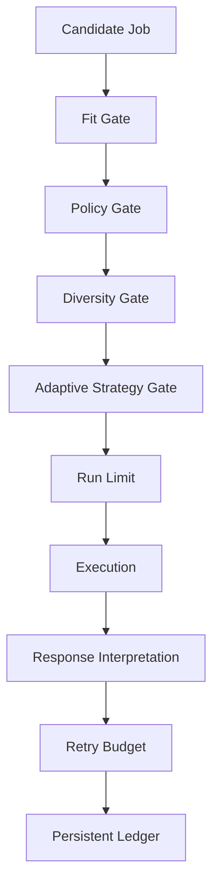

Current controls include:

- dry-run mode;
- explicit live mode;
- per-run application limits;
- per-company limits;
- role-family limits;
- duplicate detection;
- ledger-based state checks;
- server-history reconciliation;
- search cooldown;
- cache fallback;
- retry limits;
- terminal failure states;
- unresolved-question review paths;
- raw response capture;
- evidence thresholds before strategy adaptation.

---

## Network and Session Considerations

The underlying service may associate sessions and search behavior with network identity and anti-abuse signals.

The system therefore assumes:

- session validity can be affected by network changes;
- datacenter-hosted runners can behave differently from residential networks;
- search challenges should cause cooldown rather than rapid retries;
- cached search results are preferable to aggressive retry storms;
- unattended execution should use conservative schedules and application limits;
- credentials, tokens, cookies, candidate evidence, and application history are private data.

The resilience layer exists specifically to make the pipeline fail conservatively rather than repeatedly hammering a challenged endpoint.

---

## Control Plane Design Principles

### Operational truth before visual polish

The interface distinguishes live process state from historical run artifacts. Historical `RUNNING` state is never sufficient evidence that a process is currently active.

### Progressive disclosure

The Command Center exposes operational health and bottlenecks first. Detailed logs, immutable artifacts and diagnostics remain available through dedicated inspection surfaces.

### Safe execution boundaries

Dry-run and live execution are visibly distinct. Application ceilings remain explicit. The UI delegates execution to the existing runner and policy layers rather than bypassing backend controls.

### One source of truth

The UI reads from existing ledger, artifact, runner and diagnostic services. It does not maintain an independent frontend state model for application lifecycle or pipeline truth.

### Dense but scannable information

High-frequency operational signals use compact status cards, execution maps and funnels. High-cardinality data remains in tables and dedicated inspection views.

### Human attention as a first-class workflow

Manual opportunities and unresolved review cases are represented as operational queues rather than hidden log conditions.

### Desktop operations first

The control plane is optimized for a persistent desktop operations workflow: navigation remains stable, primary state is visible without deep traversal, and execution and inspection surfaces remain deliberately separated.

---

## Design Principles

### Candidate-grounded automation

Application decisions and questionnaire answers should be based on explicit candidate profile and evidence data.

### Controlled throughput

More applications are not automatically better. Policy, diversity, and strategy layers control where application volume goes.

### Conservative failure semantics

Unknown responses are not assumed to be successes. They are classified, captured, retried only when appropriate, or sent to review.

### Idempotent reconciliation

Running the monitor repeatedly should not create false changes or duplicate lifecycle events.

### Evidence before adaptation

The strategy engine does not overreact to tiny samples.

### Modular boundaries

Acquisition, classification, policy, execution, resolution, tracking, lifecycle reconciliation, analytics, and adaptation remain independently testable.

### Local-first intelligence

Questionnaire LLM fallback can run against a local OpenAI-compatible endpoint.

---

## Evolution

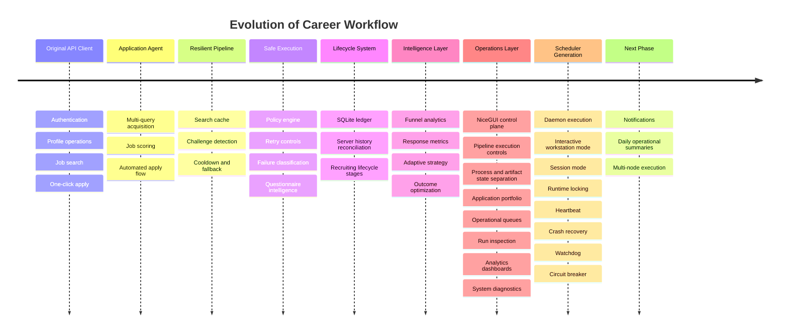

---

## Current Boundaries

The current system is intentionally scoped around a single candidate workflow and a specific job-platform integration.

Current boundaries include:

- no hosted multi-user service;
- local operations control plane rather than a hosted multi-tenant SaaS product;
- no distributed worker architecture;
- no autonomous credential management;
- no guarantee of compatibility with future upstream API changes;
- no claim that LLM-generated questionnaire answers are authoritative without candidate evidence;
- unattended single-node scheduler with runtime locking, heartbeat, watchdog and recovery is implemented;
- notifications and distributed scheduling remain future work;
- no automatic strategy adaptation before minimum evidence thresholds are satisfied.

The architecture separates platform access, decisioning, execution, tracking, and analytics so these boundaries can evolve independently.

## Roadmap

### Completed

- [x] API authentication, session management, job search and application execution
- [x] resilient multi-query acquisition with caching, challenge detection and cooldown handling
- [x] candidate-aware classification, scoring, location policy, selection and diversity controls
- [x] hybrid deterministic and local-LLM questionnaire resolution
- [x] persistent application ledger, lifecycle tracking and server-history reconciliation
- [x] funnel analytics, response metrics and evidence-gated adaptive strategy
- [x] staged pipeline orchestration with structured run artifacts and stage-level status
- [x] React operations console for pipeline execution, portfolio inspection and actionable workflow triage
- [x] process-aware and artifact-aware runtime state semantics
- [x] manual-job and human-review operational queues
- [x] lifecycle, priority, subtrack and execution analytics dashboards
- [x] immutable run inspection, preflight diagnostics and system-health visibility
- [x] daemon scheduler with runtime locking and recovery
- [x] interactive workstation scheduler mode
- [x] session-based scheduler execution
- [x] runtime heartbeat and watchdog
- [x] circuit breaker and crash recovery
- [x] structured pipeline observability

### Next Operational Phase

- [ ] multi-platform job-source and application adapters beyond Naukri;
- [ ] stronger browser automation for application flows that cannot be completed through direct APIs;
- [ ] production deployment and remote operations for continuously running the workflow;
- [ ] outcome-driven strategy optimization using application, recruiter-response and interview-conversion data.

---

## Origin and Attribution

Career Workflow originated as a fork of the NopeRi project by Traverser25.

The upstream project provided the initial API-client foundation, including authentication, session handling, profile operations, job search, job details, and application-related API integration.

This repository has since been substantially extended with independently developed systems for:

- resilient multi-query and paginated acquisition;
- search caching, challenge handling, and cooldown state;
- candidate-aware classification and AI relevance gating;
- LLM-assisted fit scoring and deterministic scoring guards;
- application policy and diversity controls;
- vacancy fingerprinting;
- hybrid questionnaire resolution;
- evidence retrieval and answer validation;
- semantic response interpretation;
- bounded retry and failure classification;
- persistent application ledger;
- recruiting lifecycle reconciliation;
- application analytics;
- evidence-gated adaptive strategy;
- staged pipeline orchestration and structured run summaries.

Repository history is preserved to maintain implementation provenance and attribution.

The upstream repository did not include a license file in the history inherited by this fork. Accordingly, no repository-wide open-source license is currently asserted here. Licensing of original contributions and upstream-derived portions should be considered separately unless explicit upstream permission is obtained.

---

## Disclaimer

This project is intended for personal automation of the repository owner's own job-search workflow.

It is not affiliated with Naukri or Info Edge. Users are responsible for reviewing applicable service terms and operating automation conservatively.

Never commit credentials, session tokens, cookies, candidate evidence, raw application responses, or private application history to public source control.

---

<p align="center">
  <strong>Discover broadly. Decide carefully. Execute safely. Adapt from evidence.</strong>
</p>
