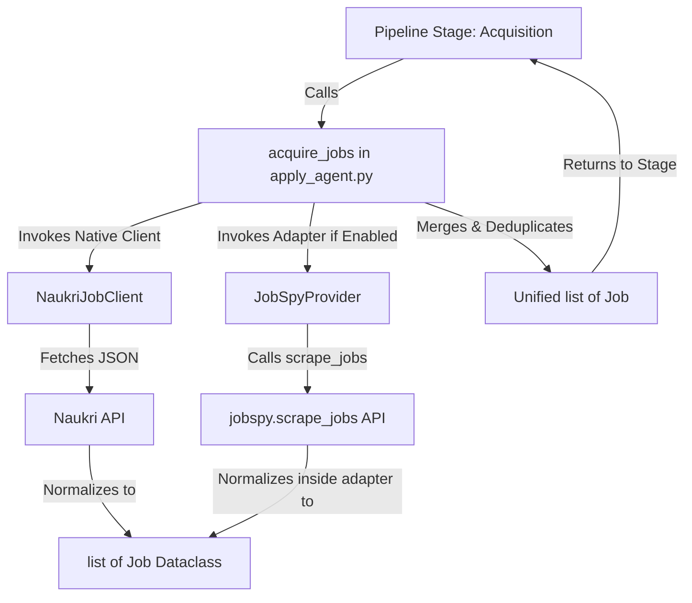
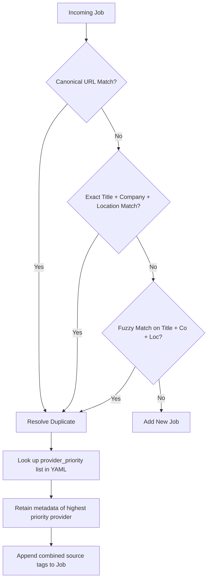

# JobSpy Technical Integration Blueprint (Career Workflow 2.0)

This document serves as the definitive architecture design and implementation blueprint for integrating **JobSpy** (`python-jobspy`) into the Career Workflow 2.0 job acquisition pipeline.

---

## 1. Project Overview

### Package Details
*   **Repository:** [speedyapply/JobSpy](https://github.com/speedyapply/JobSpy)
*   **License:** MIT License (allows unrestricted commercial use, modification, distribution, and private use).
*   **Latest Release:** `1.1.82` (as of mid-2026).
*   **Supported Python Versions:** `>=3.10`
*   **External Dependencies:**
    *   `pandas` (Internal data aggregation layer)
    *   `pydantic>=2.0,<3.0` (Schema validation)
    *   `requests` & `tls-client` (Network and TLS spoofing layer)
    *   `beautifulsoup4` & `markdownify` (HTML parsing and markdown formatting)
    *   `regex` & `numpy` (Text processing utilities)

### Maintenance and Activity Level
*   **Activity Level:** Very High. The repository is updated weekly/bi-weekly with selector fixes and anti-bot adjustments.
*   **Known Issues:**
    *   **LinkedIn Guest Access Throttle:** Unauthenticated requests face quick IP rate limiting.
    *   **Description Fetch Latency:** Fetching full job descriptions from LinkedIn via sequential sub-requests increases ban risk and increases latency.
    *   **Cloudflare Block on Glassdoor:** Frequent `403 Forbidden` failures on Glassdoor without residential proxy rotation.
    *   **Naukri/Bayt Scraper Instability:** Minor updates on Naukri and Bayt frequently break JobSpy’s selectors.

### Production Readiness Summary
JobSpy is production-ready for **unauthenticated job discovery** across Google Jobs, Indeed, and LinkedIn, provided it is decoupled behind a provider abstraction, executed with low concurrency/low result counts, isolated from core application workflows, and protected by rotating residential proxies. It is **not** a replacement for primary authenticated scraping (like our native Naukri client).

---

## 2. Target Architecture

JobSpy is integrated directly into the existing acquisition path as an independent addition. The native Naukri client remains completely untouched, avoiding any wrappers or orchestration indirection.

### Architecture Topology



### Request Flow and Data Boundary
1.  **No Pandas Leakage:** The `JobSpyProvider` adapter is the strict boundary for `pandas` usage. JobSpy internally returns a DataFrame, which the adapter must **immediately** parse into a list of internal `Job` dataclass objects. The DataFrame is discarded inside the adapter. No downstream component (orchestration, classification, selection) should ever import or interact with pandas.
2.  **Lightweight Discovery:** Set `linkedin_fetch_description=False` by default during initial search calls. The acquisition step must remain fast and low-latency. If a full description is needed for downstream classification of a promising candidate, it should be retrieved lazily in a separate, dedicated detail enrichment stage after initial title/location filtering.
3.  **Breadth Over Depth:** Rather than requesting deep pagination (e.g. `results_wanted: 500` for a single query, which invites rate limits and yields old jobs), configure the pipeline for broad, shallow acquisition. The `SearchPlanner` already generates multiple granular search profiles (e.g. `llm_engineer`, `agentic_ai_engineer` in Pune). We request low counts (`results_wanted: 20`) across these diverse queries to maximize fresh discovery without triggering bans.

---

## 3. Capability Matrix

This matrix compares the native Naukri client and the proposed JobSpy provider channels.

| Dimension | Native Naukri | JobSpy Indeed | JobSpy LinkedIn | JobSpy Google Jobs |
| :--- | :--- | :--- | :--- | :--- |
| **Authentication** | Yes (Authenticated Session) | No (Guest Scraping) | No (Guest Scraping) | No (Guest Scraping) |
| **Apply Support** | Direct/Native Apply | Redirect URL Only | Redirect URL Only | Redirect URL Only |
| **Search Precision** | High (Structured API Query) | Moderate (DOM/Keyword Query)| Moderate (Search API Guest) | High (Google search index) |
| **Descriptions** | Yes (Complete JSON/Text) | Yes (Parsed HTML) | No (Truncated unless fetched)| Yes (Full Text Snippets) |
| **Rate Limits** | High Cooldowns, Obfuscated JS| Aggressive CAPTCHA blocks | Extremely Restrictive | Moderate |
| **Freshness** | High (Direct API) | High (Index search) | Moderate-Low | High (Aggregated Index) |
| **Metadata Richness** | High (Skills, Experience, Salary)| Moderate (Salary, Company) | Low (Title, Company Only) | Low (Title, Company, URL) |
| **Stability** | High (Robust session renew) | Moderate (DOM dependency) | Low (Highly block-prone) | High |
| **Maintenance Cost** | Medium (Cookie fingerprint) | High (Scraper changes) | High (Anti-bot changes) | Low |

---

## 4. Provider Contract & Boundary

To avoid parallel abstractions and redundant inheritance trees, **we will not introduce a new `BaseProvider` class**.

*   `JobSpyProvider` shall implement the existing provider interface and design patterns already used throughout Career Workflow.
*   The adapter class will act as a standalone helper client that exposes simple signatures matching Career Workflow's capability expectations (conforming to `ProviderCapabilities` and outputting standard `Job` dataclass instances).
*   Any integration interfaces needed for routing and eligibility checks will consume the output list of `Job` objects directly, preserving the unified data model.

---

## 5. Adapter Responsibilities

The `JobSpyProvider` acts as the translation adapter for the external `python-jobspy` package.

### What Belongs in the Adapter
*   **Configuration Translation:** Mapping project strategy YAML files to the specific arguments expected by `jobspy.scrape_jobs` (e.g., matching country codes to `country_indeed`).
*   **Exception Mapping:** Translating external package errors (like `IndeedException`, `LinkedInException`, `tls_client.exceptions.TLSClientException`) into Career Workflow's internal exception taxonomy (e.g., `ProviderAccessError`, `ProviderChallengeError`).
*   **Immediate Normalization:** Mapping row values from JobSpy’s DataFrame into the internal `Job` dataclass representation.
*   **Metadata Tagging:** Appending provider identification tags (like `acquisition_source: "jobspy_linkedin"`) to jobs for lineage tracking.
*   **Duplicate Prep:** Normalizing URLs (canonicalizing and removing parameters) to enable correct merging.

### What Explicitly Does NOT Belong in the Adapter
*   **Global Deduplication:** The adapter must not know about other providers. It is only responsible for returning its own results. Merging and cross-provider deduplication is handled in the unified merge layer.
*   **Eligibility & Scoring:** Scoring job descriptions against user profiles belongs in classification and selection modules.
*   **Application Actions:** Automated apply loops are handled by the downstream apply agent and are out of scope for the acquisition adapter.

---

## 6. Provider Health Integration

Every provider instance collects health telemetry to support circuit breaking and adaptive routing.

### Telemetry Parameters
*   **Success Rate:** `successful_searches / total_searches`.
*   **Failure Rate:** `failed_searches / total_searches`.
*   **Average Latency:** Rolling mean duration of query execution.
*   **Cooldown Status:** Tracks if the provider is currently blocked (e.g. CAPTCHA, `429` block) and the remaining cooldown duration.
*   **Availability Toggles:** Checked during preflight to determine if the provider should be skipped (e.g., due to persistent `403` failures).
*   **Challenge Detection:** Tracks the frequency of CAPTCHA/WAF interventions.

### Health Integration Strategy
The pipeline orchestration reads the rolling health status:
*   **Circuit Breaker:** If the success rate of a provider drops below 50% in a given run, or if a CAPTCHA is detected, the provider is placed on cooldown (e.g., for 60 minutes) and skipped.
*   **Proxy Health:** If a proxy IP triggers consecutive blocks, the adapter flags the proxy as dead and rotates it.
*   **Dynamic Limit Control:** If latency increases on LinkedIn, the coordinator scales down `results_wanted` to minimize request footprint and avoid rate limits.

---

## 7. Merge & Deduplication Strategy

When the unified merge layer receives lists of jobs, it merges them into a single deduplicated dataset.

### Duplicate Resolution Logic



### Configuration-Driven Priority List
Instead of hard-coding provider priorities, the priority order is determined by a list in the strategy configuration file:

```yaml
provider_priority:
  - naukri
  - indeed
  - linkedin
  - google
```

When duplicate listings are detected (e.g., a job found on both Naukri and Google Jobs):
*   The orchestrator retains the attributes and apply links of the provider listed highest in the `provider_priority` array (e.g., `naukri`).
*   **Source Attribution:** Merge the source tags (e.g., adding `["source:naukri", "source:google"]` to the `tags` list) so downstream analytics can measure crossover coverage.

### URL Canonicalization Rules
Before deduplication, URLs must be normalized:
*   Convert scheme to lowercase (`https`).
*   Strip query params (such as `utm_*`, `ref`, `session_id`, `jk`, `refId`).
*   Remove trailing slashes and normalize subdomain mappings (e.g., `in.indeed.com` and `www.indeed.com` point to the same global index for canonical comparison).

---

## 8. Schema Mapping & Transformations

We normalize JobSpy’s fields into Career Workflow's internal [Job](file:///Users/ashwinireddy/Documents/Dev/job-tools/career-workflow/src/models/models.py#L28-L40) dataclass.

| JobSpy DataFrame Column | `Job` Dataclass Field | Transformation Logic | Fallback / Default | Confidence |
| :--- | :--- | :--- | :--- | :--- |
| **`id`** | `job_id` | Standardize as string: `f"jobspy_{site}_{id}"`. | `""` | High |
| **`title`** | `title` | Remove whitespaces, normalize capitalization. | `"N/A"` | High |
| **`company`** | `company` | Clean company suffix (e.g. Inc, LLC). | `"N/A"` | High |
| **`location`** | `location` | Combine City, State, Country. Append `(Remote)` if `is_remote` is `True`. | `"N/A"` | High |
| *(None)* | `experience` | Not returned by JobSpy. Extracted from description using regex patterns (e.g., `r"(\d+)\+?\s*years?"`). | `"N/A"` | Low |
| **`min_amount`**, **`max_amount`**, **`currency`**, **`interval`** | `salary` | Format: `f"{min_amount}-{max_amount} {currency} ({interval})"`. | `"Not disclosed"` | High |
| **`date_posted`** | `posted_date` | Normalize to `YYYY-MM-DD` or relative representation. | `"N/A"` | High |
| **`job_url`** | `apply_link` | Strip query strings to keep clean redirect URLs. | `""` | High |
| **`description`** | `description` | Formatted markdown (default JobSpy output). | `""` | High |
| *(None)* | `tags` | Initialize with search tracks and target profiles. | `[]` | Low |
| *(None)* | `decision_history`| Initialize with: `[{"stage": "Acquisition", "source": f"jobspy/{site}"}]`. | `[]` | High |

---

## 9. Failure Modes and Recovery

| Failure Mode | Detection | Impact | Remediation Strategy |
| :--- | :--- | :--- | :--- |
| **CAPTCHA / WAF Block** | `403` / `406` HTTP codes or `IndeedException` | Temporary loss of provider | **1.** Put provider on 60-minute cooldown.<br>**2.** Mark proxy as flagged.<br>**3.** Alert telemetry. |
| **LinkedIn Guest Ban** | Redirect to login URL | LinkedIn provider unavailable | Bypass LinkedIn search for remainder of pipeline execution; fall back to Google Jobs / Indeed. |
| **Selector Breakage** | `AttributeError` during parse | Missing field values | Log telemetry alert; fall back to parsing descriptions for missing tags/metadata. |
| **Connection Timeout** | ConnectTimeout | Slow or failed query execution | Set strict timeout (15s); skip and proceed with remaining providers. |

---

## 10. Out of Scope (Phase 1)

To prevent scope creep and maintain a low-risk integration path, the following capabilities are explicitly declared **out of scope** for this integration phase:

*   **ATS Application Support:** Autofilling job forms on third-party applicant tracking systems (e.g., automated submissions to Workday, Greenhouse, or Lever).
*   **Greenhouse/Lever/Ashby API Integrations:** Directly fetching jobs or syncing profiles via employer ATS developer portals.
*   **Semantic Deduplication Using Embeddings:** Employing vector search models or LLMs to identify matching job postings across providers.
*   **Distributed Crawling:** Spawning external workers, Docker containers, or serverless lambda pools specifically to execute search jobs.
*   **Browser Automation & Headless Scraping:** Relying on Selenium, Playwright, or Puppeteer drivers inside the JobSpy adapter.
*   **Cross-Provider Ranking:** Re-weighting or prioritising search results dynamically at fetch time based on AI scoring metrics.
*   **Automatic Provider Weighting:** Machine learning models that adjust search limits dynamically between providers.

---

## 11. Success Criteria

The integration is considered successful when the following criteria are met:

*   **Toggles Work:** JobSpy acquisition can be completely enabled/disabled via configuration.
*   **Naukri Isolation:** The existing Naukri workflow and database schemas remain unaffected and behave identically when JobSpy is disabled.
*   **Normalization:** Google, Indeed, and LinkedIn jobs are successfully normalized into the existing `Job` dataclass.
*   **Configurable Merging:** Duplicate jobs across providers merge correctly, adhering to the configured `provider_priority` list.
*   **Graceful Failures:** Failures on JobSpy scraping channels (e.g., CAPTCHAs, timeouts) do not interrupt or stop the acquisition of Naukri jobs.
*   **Test Suite Stability:** Existing pipeline tests continue to pass without modification.
*   **Live Verification:** A dry run executes and records normalized job logs to `run_dir/acquisition.json` with JobSpy enabled.

---

## 12. Future Provider Expansion

By implementing a decoupled adapter pattern, future provider integrations (such as company career pages, Ashby, or Greenhouse indexes) can be added cleanly.

*   Each new provider exposes an adapter client matching Career Workflow's expected inputs (conforming to `ProviderCapabilities` and outputting standard `Job` dataclass instances).
*   The pipeline acquisition stage calls each enabled adapter sequentially, normalizes dataframe/JSON payloads internally, and merges results using the configurable deduplication layer.
*   Core pipeline components (scoring, database tracking, LLM classification) remain entirely agnostic of where job data originated.

---

## 13. Configuration Strategy

We configure the acquisition pipeline in `config/search_strategy.yaml`:

```yaml
acquisition:
  cooldown_minutes: 60
  concurrency_limit: 3
  provider_priority:
    - naukri
    - indeed
    - linkedin
    - google
  providers:
    naukri:
      enabled: true
      # Naukri configurations here (uses existing system)
    jobspy:
      enabled: true
      sites:
        - google
        - linkedin
        - indeed
      results_wanted: 20              # Shallow scans to avoid blocks
      hours_old: 72                   # Freshness filter
      linkedin_fetch_description: false # Fast, lightweight discovery
      timeout_seconds: 15
      proxies: []                     # Rotated from env variables
```

### Justification
*   `results_wanted: 20`: Avoids triggering bot detectors during pagination. Shallow, broad crawls are safer.
*   `linkedin_fetch_description: false`: Keeps the initial crawl fast. LinkedIn descriptions can be scraped or enriched lazily later for jobs that pass initial scoring.
*   `hours_old: 72`: Matches existing 3-day age limits for job freshness.

---

## 14. Testing Plan

### Unit Tests
*   `test_jobspy_normalization`: Asserts that `JobSpy` DataFrame columns map correctly to `Job` fields, and that default fallbacks work when fields are missing.
*   `test_url_canonicalization`: Asserts query string parameters are stripped from apply URLs.
*   `test_provider_cooldown`: Asserts that when a CAPTCHA exception is raised, the provider status transitions to cooldown.

### Integration Tests
*   `test_configurable_merging`: Mocks Naukri and JobSpy results to verify duplicates merge and retain Naukri metadata according to `provider_priority`.
*   `test_disabled_provider_skipped`: Asserts that toggling a provider `enabled: false` bypasses its execution.

### Live Telemetry Verification
*   Execute a dry run (`--acquisition-mode incremental`) with JobSpy enabled, confirming that normalized job logs are written to `run_dir/acquisition.json` without downstream pipeline changes.

---

## 15. Implementation Checklist

Below is the refined implementation sequence:

- [ ] **Phase 1: JobSpyProvider Adapter Skeleton**
  - Setup strategy configuration parameters and `provider_priority` fields.
  - Add `python-jobspy` to `requirements.txt`.
  - Create `src/acquisition/providers/jobspy_provider.py` with mock/empty search capability that runs without crashing.
- [ ] **Phase 2: Normalization Mapping**
  - Map JobSpy DataFrame rows directly to internal `Job` dataclass fields inside `JobSpyProvider`.
  - Ensure DataFrame is immediately discarded and never leaks outside the provider adapter.
  - Implement fallback rules for missing fields (like experience).
- [ ] **Phase 3: Configurable Ingestion & Merging**
  - Wire `JobSpyProvider` into `apply_agent.py` / `acquire_jobs` and merge its results with Naukri's output.
  - Implement duplicate detection and URL canonicalization.
  - Support configurable `provider_priority` list in YAML.
- [ ] **Phase 4: Cooldown & Health Integration**
  - Wire proxy list support and sequential delays between queries.
  - Set `SearchChallengeCooldown` files when CAPTCHA/WAF triggers are hit on JobSpy providers (such as Indeed).
- [ ] **Phase 5: Refactoring & Testing**
  - Run dry-runs and live verification.
  - Implement unit and integration tests.
